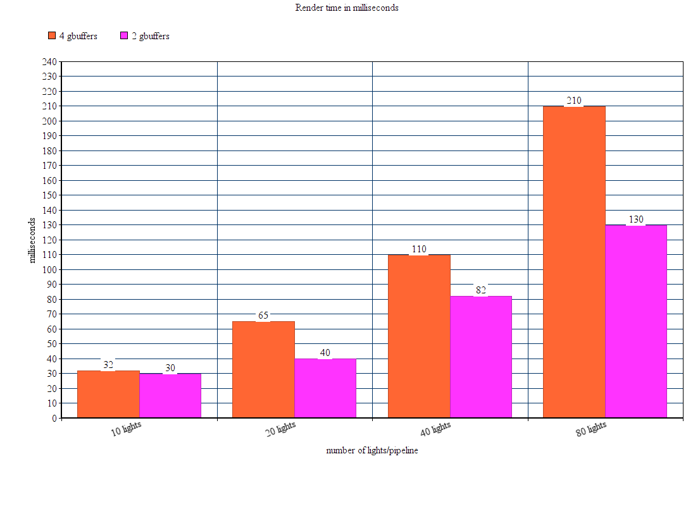
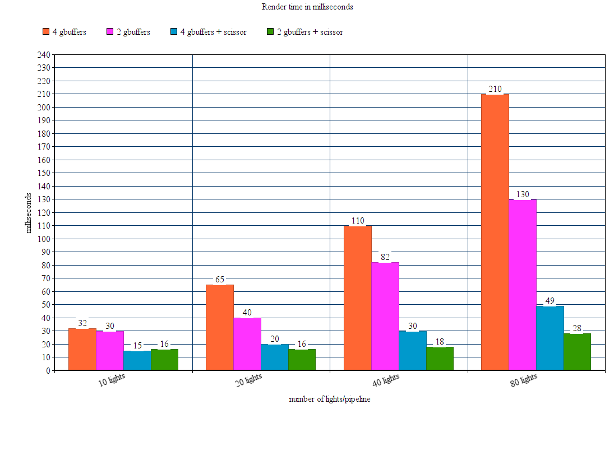
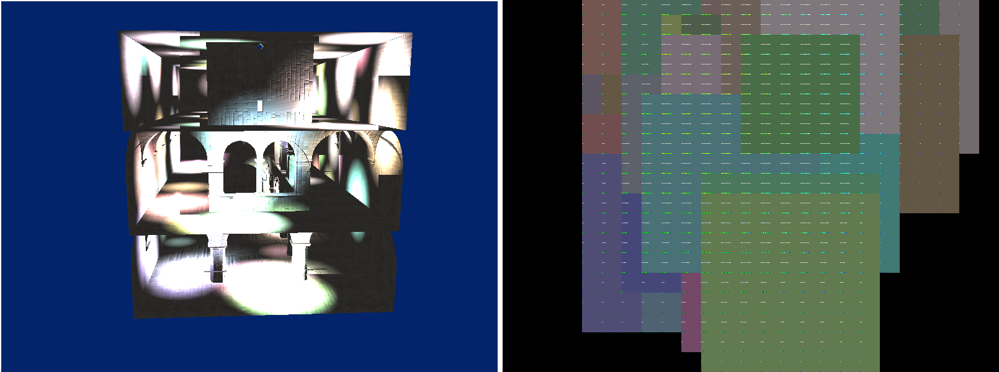
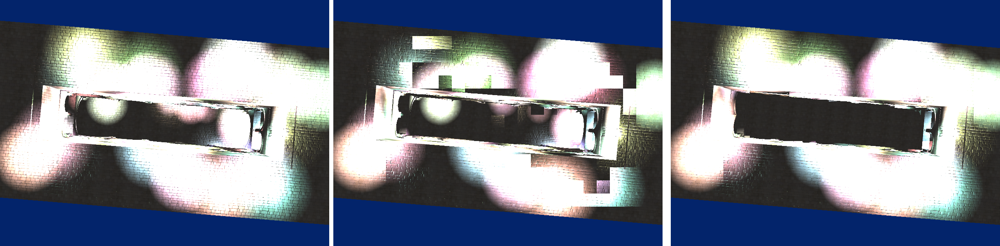
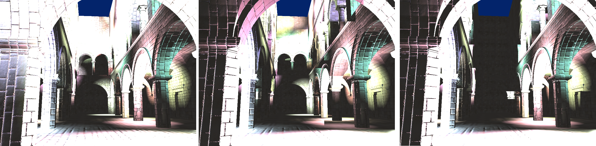
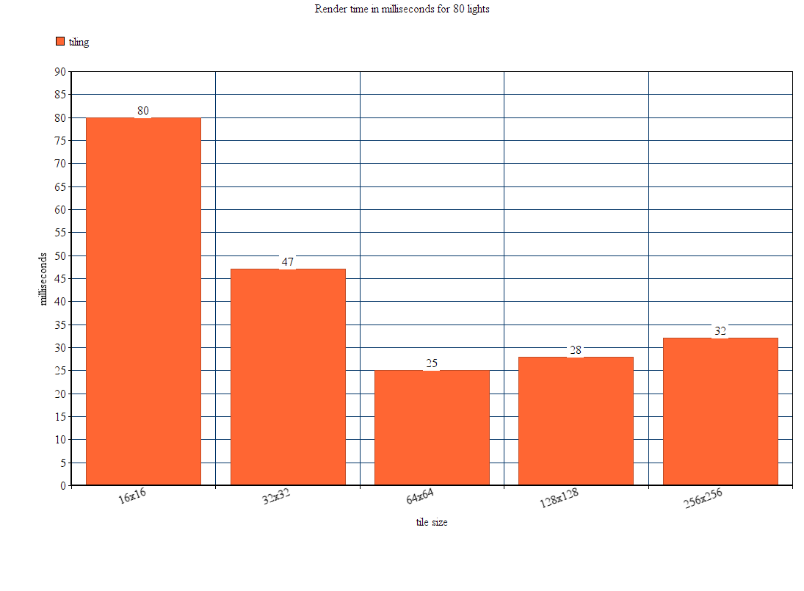
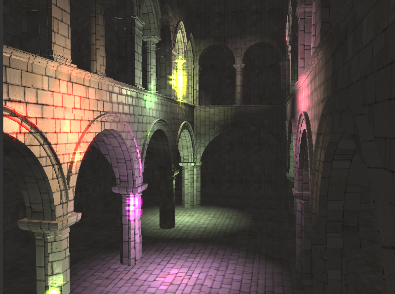
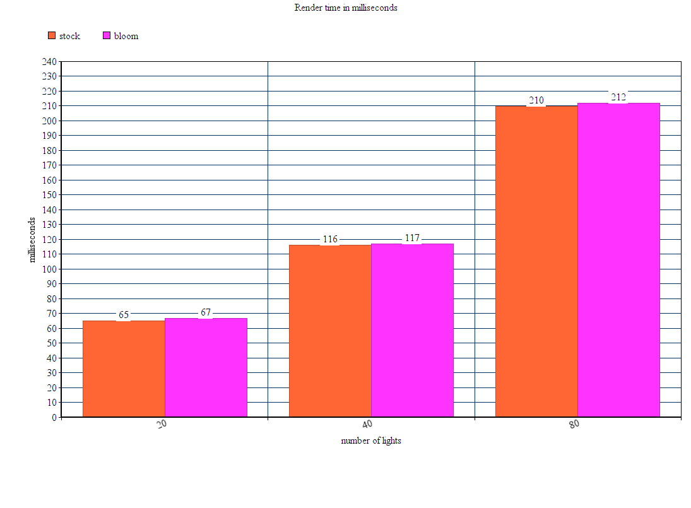

WebGL Deferred Shading
======================

**University of Pennsylvania, CIS 565: GPU Programming and Architecture, Project 6**

* Kangning Li
* Tested on: **Google Chrome 46.0.2490.80** on
  Ubuntu 14.04, i5-3320M @ 2.60GHz 8GB, Intel HD 4000 (Personal laptop)

### Live Online

### Demo Video

This repository contains a WebGL deferred shader with the following features:
- deferred shading using WEBGL_draw_buffers
- a toggleable "compressed g-buffer" pipeline
- toggleable scissor testing for both the compressed and uncompressed pipelines
- a tile-based lighting pipeline
- toon shading
- bloom as a post-processing effect

Running the demo above requires support for `OES_texture_float`, `OES_texture_float_linear`, `WEBGL_depth_texture`, and `WEBGL_draw_buffers`. You can check your support on [WebGL Report](http://webglreport.com/).

### Deferred Shading Overview
The standard deferred shader in this project renders data (position, normals, sampled color, depth, etc.) about what is visible in the scene to a set of WebGL textures referred to as g-buffers. These can be viewed in the debugView settings in the demo. These textures are then passed to a lighting shader that only performs lighting calculations on what is visible in the scene.

### G-buffer compression
The default pipeline uses 4 g-buffers of vec4s to pass scene information to the lighting shader, along with a buffer for depth:
- position
- normal provided by the scene geometry
- texture mapped color
- texture mapped normal

The "compressed" pipeline instead uses 2 g-buffers along with depth:
- texture mapped color
- "compressed" 2-component normal vector (computed from texture mapped and geometry)

This compression and decompression of the normal depends on the normal being unit length, which lets the lighting shader compute the magnitude of the normal`s `z` component from its `x` and `y` components. The cardinality of the `z` component is sent as part of the `y` component by padding. If the `z` component is negative , the `y` component is "padded" with a constant so that its magnitude is greater than 1. The lighting shader then only needs to assess the `y` component`s magnitude to determine the `z` component`s cardinality and correctly rebuild the `y` component.

The lighting shader also reconstructs the world position of a pixel from its depth and screen coordinates with the current view`s camera matrix. More details on the technique can be found [here](https://mynameismjp.wordpress.com/2009/03/10/reconstructing-position-from-depth/) and [here](http://stackoverflow.com/questions/22360810/reconstructing-world-coordinates-from-depth-buffer-and-arbitrary-view-projection).

Using "compressed" g-buffers is essentially a tradeoff between memory access and computation, which is usually ideal for GPU applications as GPUs are better at compute than memory access. Even in this imperfect case, in which the 2-component normals are still stored in a vec4 texture, reducing the number of g-buffers still leads to a noticeable improvement in performance. This performance improvement is apparent even as the number of lights increases, as the both pipelines run the lighting shader once per light.

### Scissor test

Both the "compressed" and "uncompressed" g-buffer pipelines can optionally restrict the screen-space render area of each light using a scissor test, which in most cases speeds up the lighting shader computation for each light. A screen-space bounding box is computed for each light on the CPU, which then restricts the area that the GPU can draw over. This scissor test also allows us to skip lighting for lights that couldn't possibly be visible in the viewport, which is likely a large part of the performance boost.

However, the scissor test is only really useful for the "general" case, where a light's influence covers a relatively small area of the screen. In the case that a light is very close to the camera, the scissor test becomes less beneficial as the light pass for that particular light will essentially span the entire screen.

### Tile based lighting

The lighting pipelines mentioned above all compute each light's influence independently and blend the result, essentially placing one draw-call per light, which leads to repeated access to the g-buffers and the framebuffer being drawn to.

One alternative to this is to inform the shader of the lights that influence an area of the scene and have the shader read the position, normal and color data once and then iterate over the given lights, then write the final accumulated result out to the framebuffer. This technique requires splitting the screen space into tiles and computing a datastructure that the shader can access to check the lights that influence a particular tile.

This implementation of a tiled pipeline stores this datastructure in another gbuffer and stores lists of light positions and colors, which limits the number of lights that can influence each tile based on the tile's resolution. Each screen space tile of this datastructure gbuffer is split, with one half holding a list of light colors as a vec4 and the other half holding the lights' positions and radii. The end of the list is demarkated with a colorless light with a negative influence radius and extreme z position, thus showing as a blue pixel in the debug view. Thus, the limit on the number of lights is TILE_SIZE * TILE_SIZE / 2, which for a 32 x 32 tile is still 512 lights.

This datastructure is computed on the CPU for each light in order, which becomes a performance bottleneck with more lights. Thus, this implementation includes options in the code to set a lower limit on the number of lights that can influence a tile. However, this can lead to undesireable artifacting, as lights that should prominently influence a tile may be omitted when the tile's light list is being computed. This implementation attempts to slightly alleviate this problem with an option to sort the lights based on their z-depth from the camera before computing the light list, thus reducing artifacting in some brightly lit planes that are closer to the camera and roughly parallel with the image plane. 

without tiling, with tiling, and depth sorted

However, this does not completely resolve the problem for scenes that have multiple parallel planes at different depths.

without tiling, with tiling, and depth sorted

(all data measured using 32x32 tiles)

Tiling leads to noticeable performance improvements in scenes with large numbers of lights. However, again, the computation of the tile datastructure on the CPU is a major performance bottleneck with scenes that have fewer lights but many tiles.

### Bloom

Bloom works by sampling the area around each pixel of the lighting pass's output for pixels with a luminance greater than 1, indicating a "bright light." Because it is implemented as a post-processing step, it works across all lighting pipelines and adds a constant performance hit over the number of lights in the scene.

### Toon Shading

