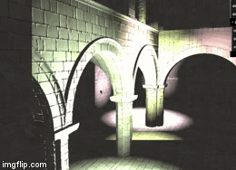

WebGL Deferred Shading
======================

**University of Pennsylvania, CIS 565: GPU Programming and Architecture, Project 6**

* Megan Moore
* Tested on: Google Chrome on MacBook Pro 2.6 GHz Intel Core i5 @ 8 GB 1600 MHz DDR3, Intel Iris 1536 MB

### Live Online

### Demo Video

In this project, I implemented a deferred
shading pipeline and various lighting and visual effects using WebGL and GLSL.

**Effects:**

* Implement deferred Blinn-Phong shading (diffuse + specular)
  * With normal mapping (code provided)
 
  

  * The Blinn-Phong shading was the first effect implemented. This is a deferred shader and does not use any post processing.  The Blinn-Phong lighting was applied with normal mapping.  

* Implement Bloom using post-process blur 
  * Using post-process blur (Gaussian) [1]
   
 

  * Bloom was implemented using a two-pass Gaussian blur.  The first pass allows for the blur to be applied horizontally, while the second allows for the blur to be applied vertically.  By splitting this process up into two passes, we are able to increase the speed of the effect.  Doing this in one pass would require n^2 amount of time, where n is the diameter of the blur.  However, in a two-pass process it only requires 2n.  Overall the bloom effect slightly decreased the speed of the program.  It went from 35 FPS to 29 FPS, causing a drop of 6 FPS.  
 
* Implement Toon shading 
  * With ramp shading and simple depth-edge detection
   

 
  * Toon shading requires just one post process pass.  In order to implement toon shading, the diffuse and specular values in the blinn-phong shading were manipulated to be step functions, rather than continous functions.  If the diffuse term was lower than .5, it became .2.  If it was higher than .5, it became 1.0.  The same was done for the specular value.  This allows for the distinct change in color on the models.  This was all done in the blinn-phong shader.  Then, the edge detection was done in the post-process pass.  The color of 8 neighboring fragments was collected.  If the mix of all those fragments was greater than a certain threshold, it meant that the color was changing and this fragment was on the edge of a material.  Thus, it's color should be changed to black.  This implementation took less time than the bloom implementation, it only slowed down the program by 4 FPS.
  * It took a while to get this implementation correct.  Below are some of the early stage toon images.  At first, the diffuse term was backwards, causing the lights to be very bright on the edge and dark at the center.  Then, I had the correct shading, but no outlines.  
  
 

* Allow variability in additional material properties

  * This effect was implemented, by adding an extra variable to each model that was loaded into the scene.  As the model's data was being copied into the GBuffer, the specular exponent that had been loaded with the model, was copied into the fourth element of the normal vector in the GBuffer.  Then it was used in the blinn phong calculations.  This did not add on any extra run-time, as it didn't add to the size of the GBuffers that were being copied and passed into the shaders.  

* Screen-space motion blur [3]

  * This effect was implemented in a post process pass.  The previous frame's camera matrix was kept in a global variable that could be passed into the shader during the next frame.  With that, I am able to calculate the current world coordinates' texture coordinates of the previous frame.  From this, I can calcualte the velocity of the fragment by taking the difference between the two coordinates.  Then, I sample the colors along a vector going in the direction of the velocity.  The average of this sample becomes the new fragment color.  
  * There is also a debug view for this effect.  It shows the velocity (in color) at each fragment.  

**Optimizations:**

* Scissor test optimization, Old and Improved

 

  * This is the original scissor test.  When accumulating shading from each light source, I only want to render in a rectangle around the light.  This helps to increase the run time of our program.  In this case, the scissor test allowed my FPS to go from an average of 14 to 31.  The images above show the debug view, which has all the rectangles that are being rendered, and an image of the actual rendered model.  

 
  
  * The scissor test was able to be improved.  By calculating amore precise bounding box, around the entire light sphere, I was able to increase the speed and accuracy of the render.   The speed up was less impressive, but still allowed for the FPS to increase to an average of 35, improving it by 4 FPS.  Also, there are no longer any cut offs on the lights.  You can see on the image on the right, the light in the upper right corner is cut off in the original image, but not in the image directly above.  

* Optimized g-buffer format - reduce the number and size of g-buffers:
  

  * In order to reduce the size of the GBuffer, I applied the normal map function during the copy fragment shader, rather than in the ambient, blinn-phong, and debug shaders.  This allowed me not to pass through both the geometry normal and normal map.  I could just pass the surface normal into the shader.  You can see from the graph above, that having a smaller GBuffer size increased the FPS in all cases.  This increased performance because the bounding boxes became more accurate, and there was no extra computations that were required which would slow it down. 

## Resources

* [1] Bloom:
  [GPU Gems, Ch. 21](http://http.developer.nvidia.com/GPUGems/gpugems_ch21.html) 
* [2] Screen-Space Ambient Occlusion:
  [Floored Article](http://floored.com/blog/2013/ssao-screen-space-ambient-occlusion.html)
* [3] Post-Process Motion Blur:
  [GPU Gems 3, Ch. 27](http://http.developer.nvidia.com/GPUGems3/gpugems3_ch27.html)

### GitHub Pages

Since this assignment is in WebGL, you can make your project easily viewable by 
taking advantage of GitHub's project pages feature.

Once you are done with the assignment, create a new branch:

`git branch gh-pages`

Push the branch to GitHub:

`git push origin gh-pages`

Now, you can go to `<user_name>.github.io/<project_name>` to see your
renderer online from anywhere. Add this link to your README.

