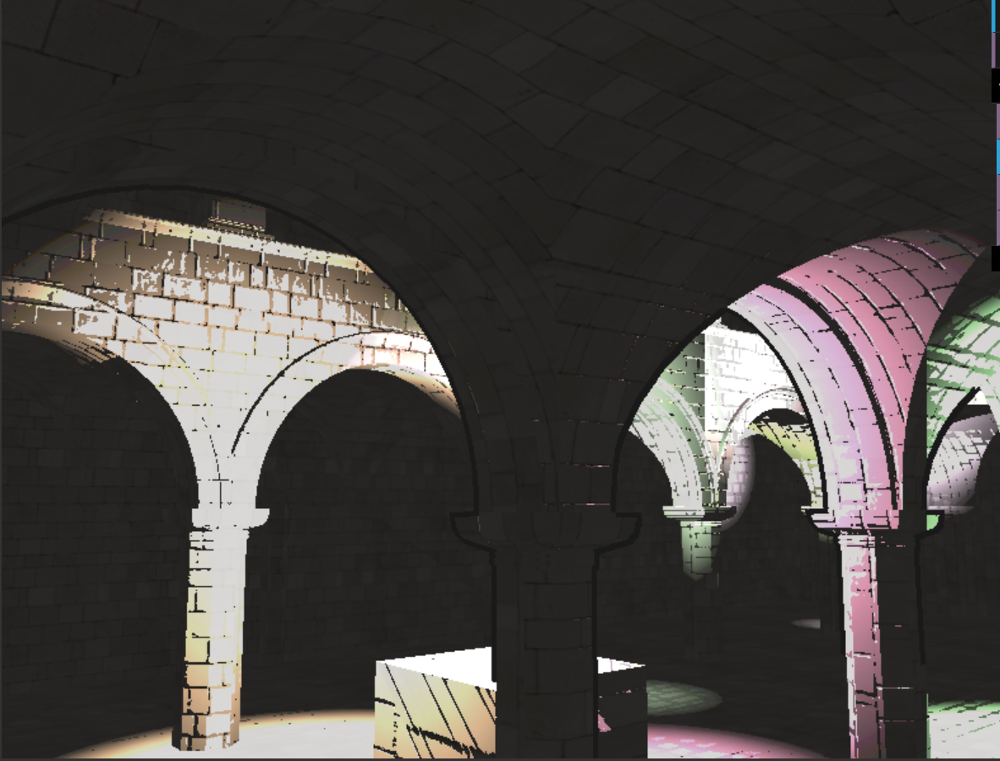
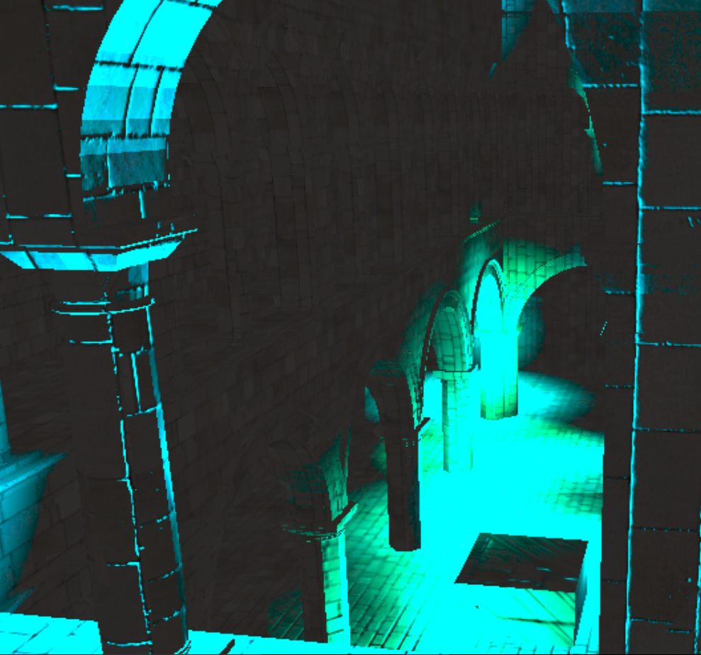
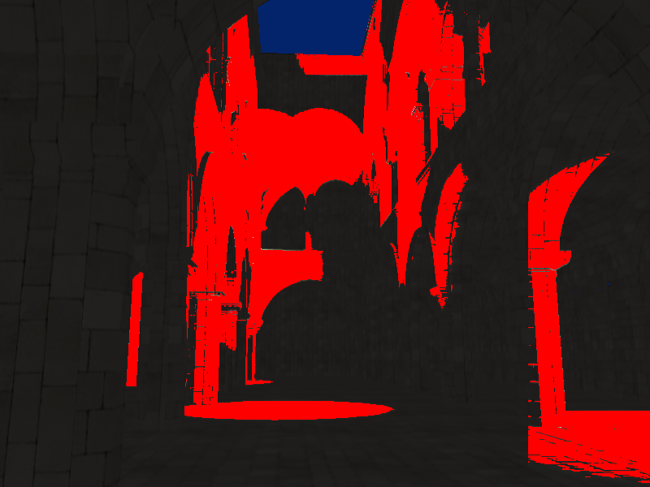
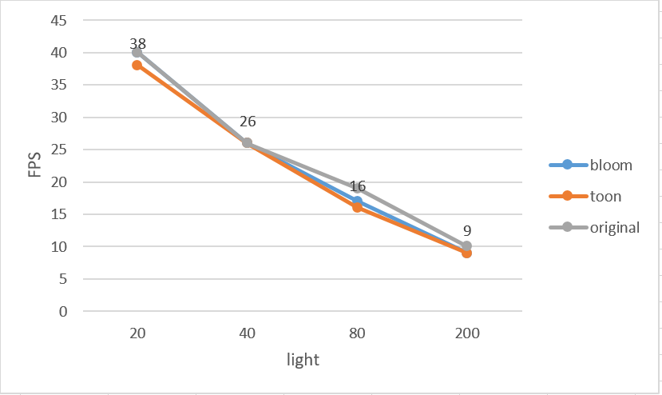
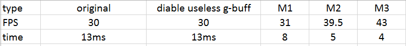
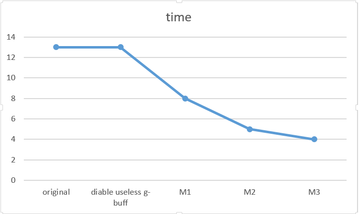
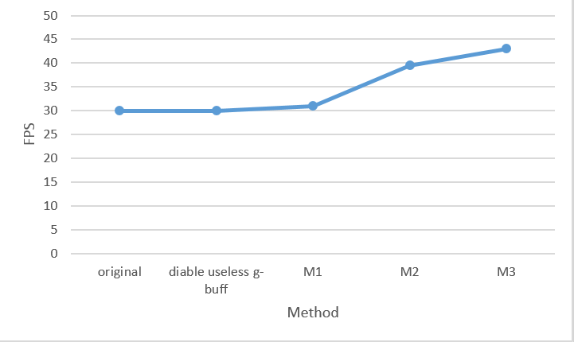
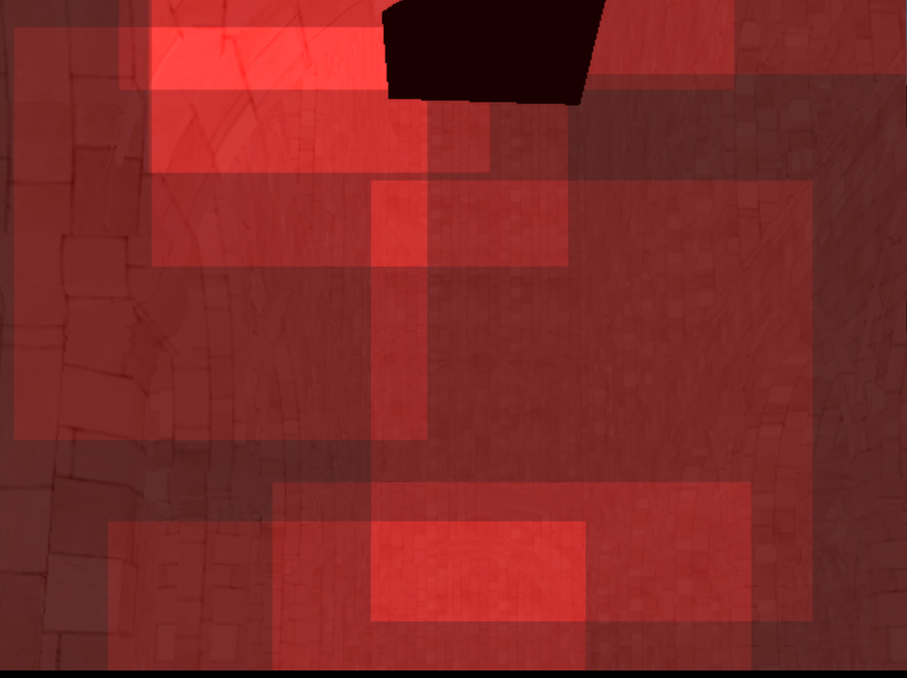

WebGL Deferred Shading
======================

**University of Pennsylvania, CIS 565: GPU Programming and Architecture, Project 6**

* Xinyue Zhu
* Tested on: **Google Chrome  46.0.2490.71 m** on
  Windows 10, i5-5200U @ 2.2GHz 8.00GB, GTX 960M 222MB 

### Live Online

### Demo Video

========================
### Feature
Features:

1.Blinn-Phong shading for point lights.

2.scissor test and debug view.

3.bloom shading using Gaussian blur.

4.Optimized g-buffer.
 
Extra:

5.Toon shading, the width of the outline is changed due to the distance to the viewer, more like comic.

6.Allow variability in additional material properties. add extra cube.since all the texture I find for the cow makes it look wired.

7.Optimized 2 pass Gaussian bloom.

8.AABB box for light.

##the toon effect

 
Happy Helloween!

 
### Performance & Analysis

1.The number of the light increase the memory usead is increase, and the FPS is decrease.

In the bloom effect, I choose 5*5 simples, int the toon I only calculate the left and top three samples, but their performace do not make much difference. However in the bloom effect, I devide Gaussian matrix into two passes, x and y pass. I think that's why it is a little faster. I think I should change the toon into x y pass to get a more accurate result. 

Increasing the number of the models, makes the program much slower.

these are the g-buffers improvment I made. First only disable the buffer do not make much difference.

note: M1: pack the specular parameter into posision.w

M2:apply normal map before

M3:if I do not use the specular parameter in g-buffer and take the color value apart and reduce the number of g-buffer to 2.

Since I have to use the specular component, so I use the 3 buffers in the end. But reducing the number of g-buffers accelerate the program dramatically. 

 

The debug view of the original bounding box

The debug view of the current bounding box. I calculate is as a "box" not a plane so the length of the box maybe bigger 

When calculating the boundingbox, I was plan to buil a box with 6 point and apply transform an projection matrix on it and it is very slow so I did not use that method.

