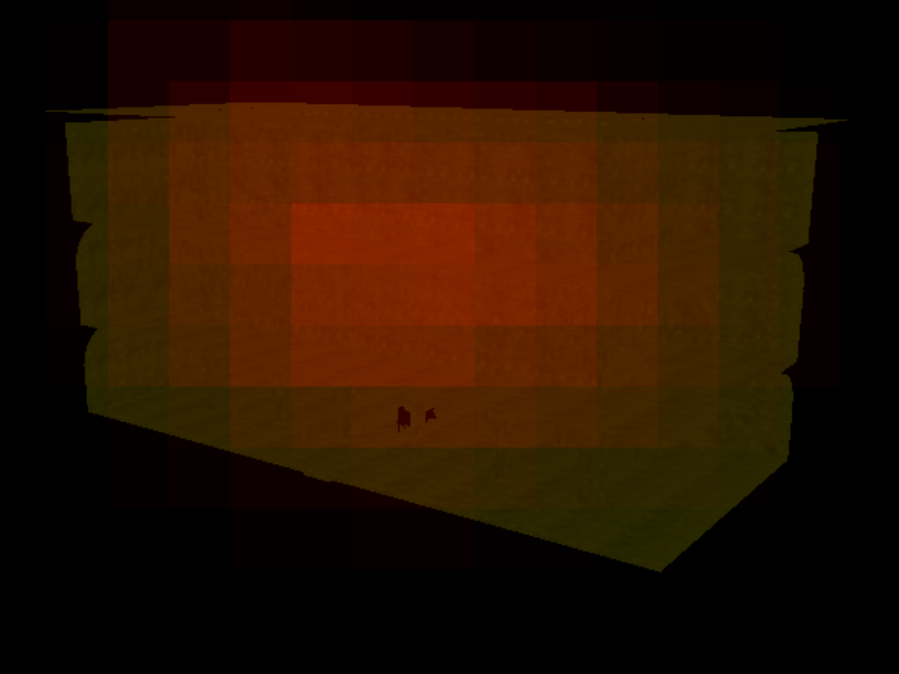
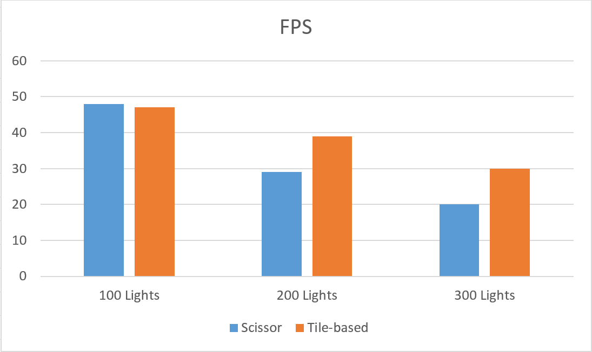

WebGL Deferred Shading
======================

**University of Pennsylvania, CIS 565: GPU Programming and Architecture, Project 6**

* Ratchpak (Dome) Pongmongkol
* Tested on: **Google Chrome 46.0.2490.71 (64-bit)** on Windows**, 2.4 GHz Intel Core i7, 16 GB 1600 MHz DDR3, NVIDIA GeForce GT 650M 1024 MB (rMBP 15" 2013)

### Demo Video

### Features
This is a deferred Blinn-Phong shading with 3 g-buffers as follows 

          x     y     z     w 
    1 : pos.x pos.y pos.z  sExp 
    2 : nor.x nor.y nor.z sCoeff 
    3 : clr.x clr.y clr.z   0

when 
- pos = Position 
- nor = Normal (transformed by a bump map at the given fragment) 
- col = Color (pulled out from a texture map at the given fragment)
- sExp = Specular Exponent 
- sCoeff = Specular Coefficient

#### Effects (Each can be stacked on top of each other)
- **Toon Shading** : Ramp Shading + Sobel operator (for detecting edges)
- **2-pass Gaussian Blur Bloom** : use Gaussian function to multiply with color from neighbor pixels that has RGB components larger than 1.0. To make use of GPU parallelization nature, this is done in two passes, horizontal first, then vertical. (Instead of having each thread going through MxN pixels).
- **Screen Space Motion Blur** : For each pixel, convert back to world space, then use the viewProjection matrix of the previous frame to get the previous "screen space" position of each pixel. Calculate a velocity from that and use it to do motion blur.

### Optimization
##### gl.scissor
Instead of render the whole scene for each light source (which is expensive), why not render only the area that the light covers instead? To do this, we calculates AABB of the light source "sphere" and, if the AABB is in the viewing volume, use it to calculate x, y, width, height for gl.scissor.

*Each red box represents the areas we render for each light source*

##### Tile-based deferred shading
The previous method has one serious drawback, that is, the amount of time the g-buffers will be passed into the shader program will be equal to the number of lights. This will slow things down if # of lights are large.

Another way to speed things up is to divide screens into "tiles", say 40x40. Then we *count* how many lights are involved in each tile's calculation. We then create 3 textures to store light information.

 1. **A texture containing light colors** : This can be uploaded during the initialization once and doesn't require any update (Unless you want the colors to change over time)
 2. **A texture containing light position** : If the light sources are moving, this needs to be updated in every frame.
 3. **A texture that tells which lights are included in each tile's calculation** : This is basically a 2D texture (each row representing each tile's light source) that contains indexes of the lights in texture 1 and 2. This also needs to be updated if the light sources are moving.

*Each red box represents the # of light sources of each tiles*

Because of this, the g-buffers will be passed into the program for a fixed amount of time (= total # of tiles) regardless of # of lights. Given that the "light textures" passed into the program should be significantly smaller than the total g-buffer size in the previous method, this should give a significant speed-up to our renderer.

Please note that the drawback of this method is the CPU calculation for packing texture #2 and #3. So if the # of light source is significantly small, this method might not be the best choice.

*Scissor vs tiled-based (40x40)*

###  Acknowledgement
- Motion Blur : http://http.developer.nvidia.com/GPUGems3/gpugems3_ch27.html
- Bloom : http://http.developer.nvidia.com/GPUGems/gpugems_ch21.html
- Gaussian blur equation function : https://www.shadertoy.com/view/XdfGDH
- Sobel Operator for Edge Detection: https://en.wikipedia.org/wiki/Sobel_operator
