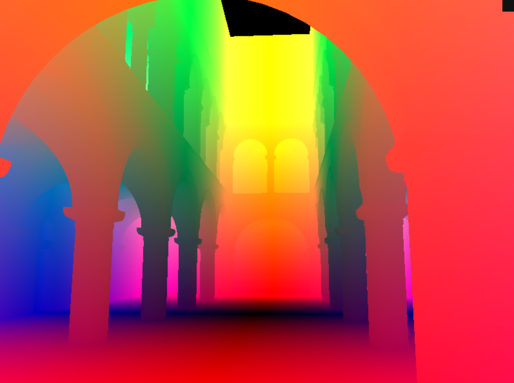
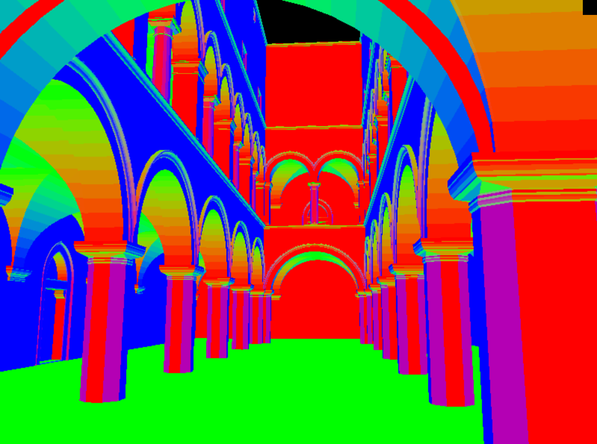
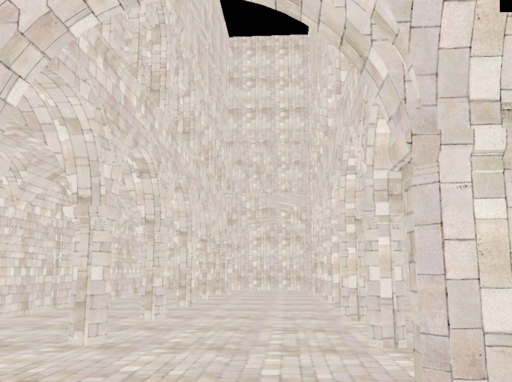
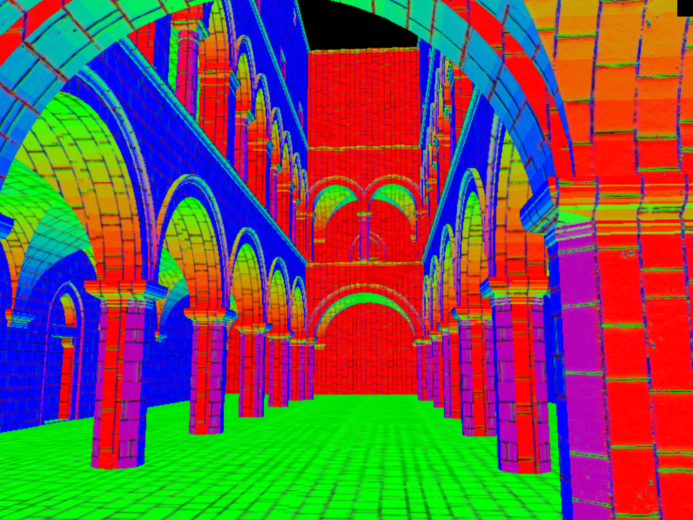
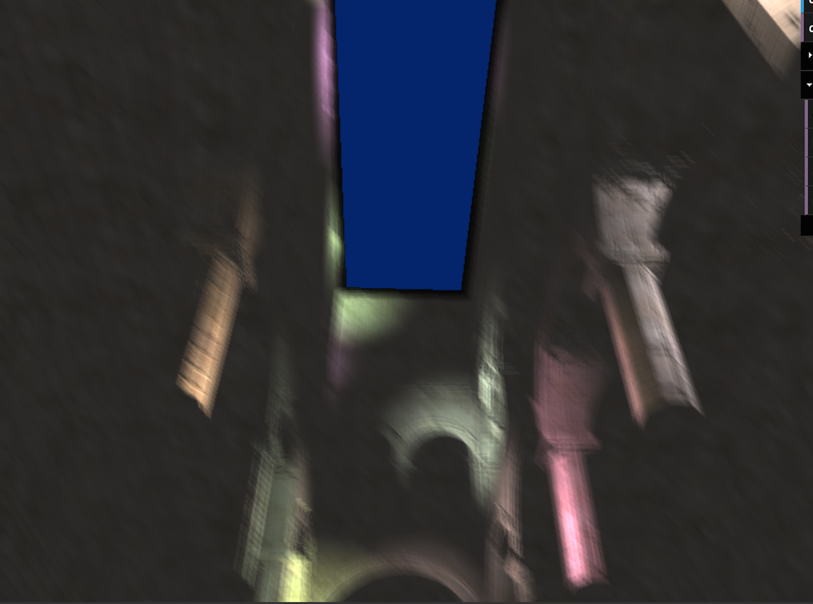
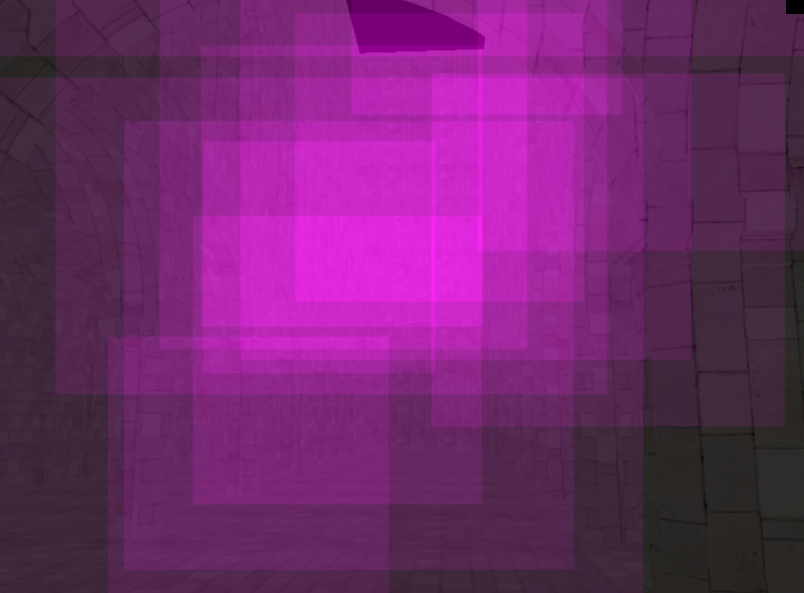
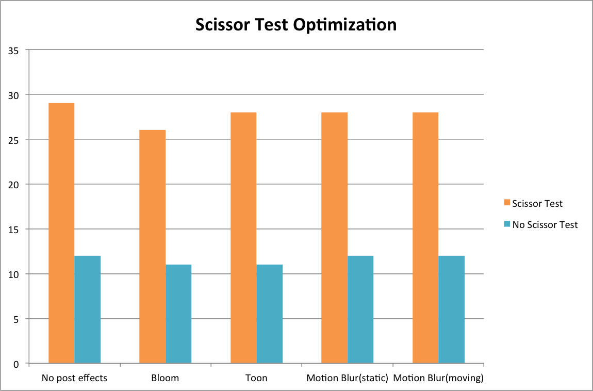

WebGL Deferred Shading
======================

**University of Pennsylvania, CIS 565: GPU Programming and Architecture, Project 6**

* Ziwei Zong
* Tested on: **Google Chrome 46.0** on
  Mac 22, i7-2222 @ 2.22GHz 22GB, GTX 222 222MB (Personal)

### Live Online

### Demo Video

Features
========================

### Basics

**Debug Views**

|Depth						 |Position
|:--------------------------:|:---------------------------------------:
|	 |
|Geometry Normal			 |Texture Color
|	 |	
|Normal Map					 |Surface Normal
| |

### Post Effects

####Bloom Effect

####Toon Shading

	

####Motion Blur

Optimizations
========================

### Scissor Test

Instead of rendering the full quad, scissor test allows it to render only a bounding box in the frame (as shown in the debug image above). The performance if almost three times faster after using scissor test, as shown below.

### Two-pass Gaussian for Bloom Effect

Using the method in [[1]](http://http.developer.nvidia.com/GPUGems/gpugems_ch21.html) with a convolution widow of 7x7,first blur the masked source in X direction and then in Y direction. Though I haven't implement single pass method, I assume two-pass can improve the performance due to the reason that it total computs 7xres +7xres = 14res pixels while one-pass method computes 7x7xres = 49res pixels.

### G-Buffer Optimization

These two methods below are used to reduce the g-buffer size:

* Apply geometry normal and normal map in copy.frag: doing so directly reduces one g-buffer.

* Reduce normal size and pack them into position buffer and color buffer: only keep two elements in the normal vector, then put each of them into the pos.a and color.a relatively. The g-buffer size then reduced to only two. However, after reducing the normal size, there are some black spots on some surfaces.

Resources
========================

* [1] Bloom:
  [GPU Gems, Ch. 21](http://http.developer.nvidia.com/GPUGems/gpugems_ch21.html) 
//* [2] Screen-Space Ambient Occlusion:
//  [Floored Article](http://floored.com/blog/2013/ssao-screen-space-ambient-occlusion.html)
* [2] Post-Process Motion Blur:
  [GPU Gems 3, Ch. 27](http://http.developer.nvidia.com/GPUGems3/gpugems3_ch27.html)
