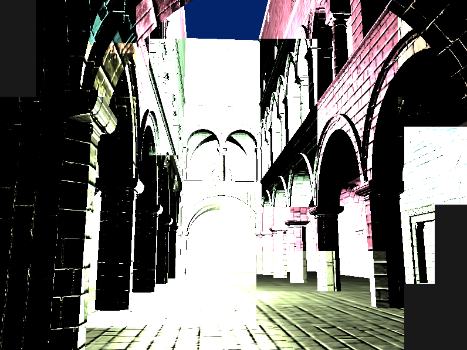
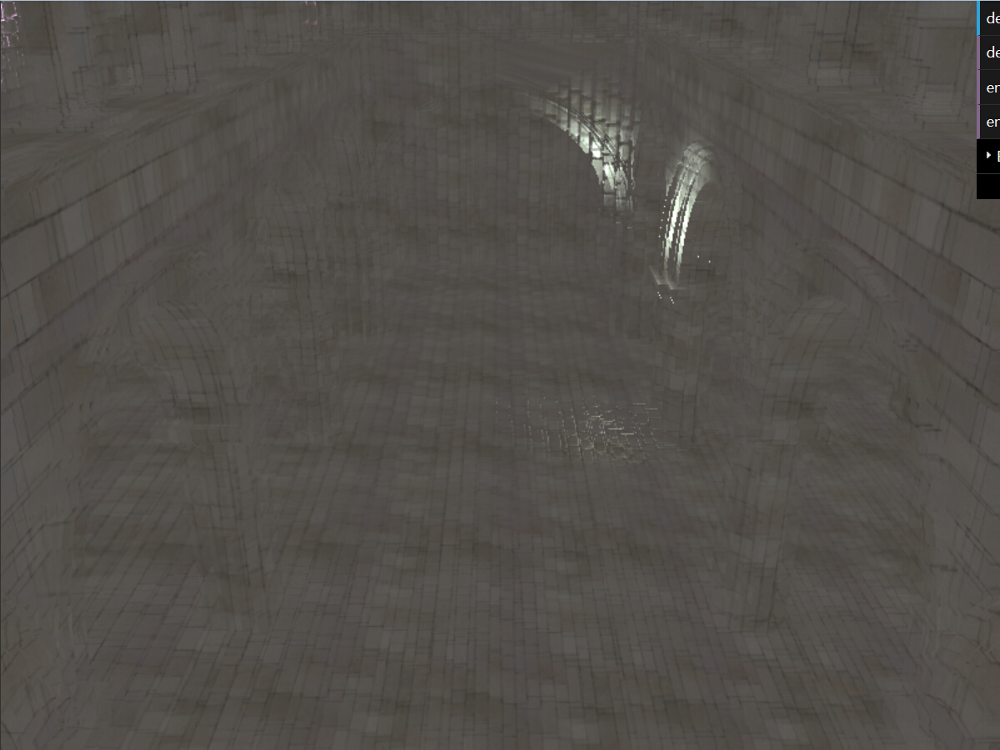
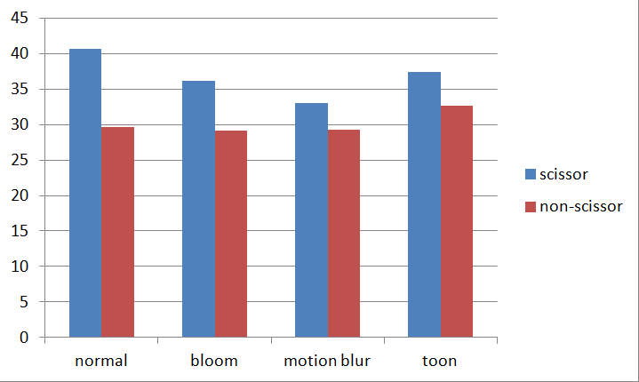
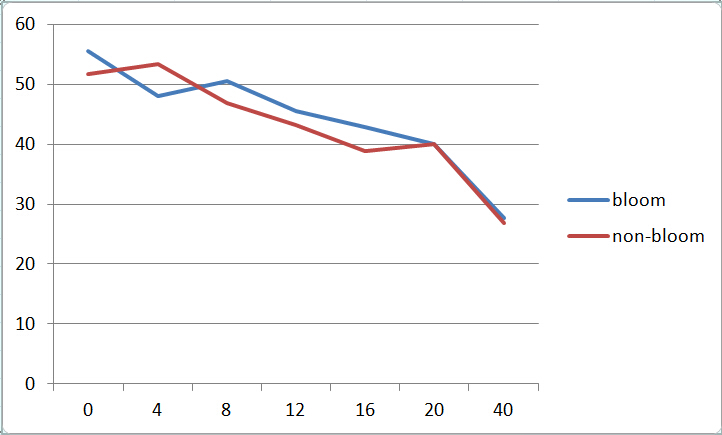
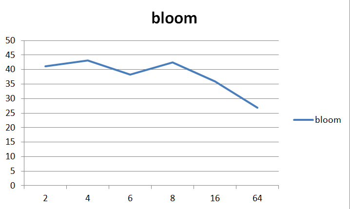

WebGL Deferred Shading
======================

**University of Pennsylvania, CIS 565: GPU Programming and Architecture, Project 6**

siqi Huang Tested on: Windows 7, Inter(R) Core(TM) i7-4870 HQ CPU@ 2.5GHz; GeForce GT 750M(GK107) (Personal Computer)

#Representative Images:

#Part O: Browser Setup
This should be a very easy part, as many browser nowadays support WebGl 1.0 or higher. But in my case I still have problems and spend a whole day dealing with it. First I tried to use Chrome but it seems that it only support WebGl 1.0. To enable the WebGl 2.0, you have to add parameter in its command line[1]. This method work fine in majority of time, but unlucky I am not in that range, so I turn to FireFox and setup the browser for WebGl.

#Part I: Simple Red Squad
For this part I still used much time. Really not familiar with the js function. In general, what I did is create and bind buffer, give point location to shader and render. After all this, the dark screen is in red.

#Part II: Debug Views
After pass value to the copy.vert.glsl. All debug view is easy to get.

1 Depth: Simply use depth value to render.

2 Position: Simply use position to render

3 Geometry Normal: Simply use geometry normal to render

4 Color Map: Simply use color map to render

5 Normal Map: Simply use normal map to render

6 Surface Normal: Use normal map*geometry normal to render

# Part III: Ambient Shader(With Toon Shading)
Here the default value is black. I use the color map(texture) as its ambient color. Because the texture is too light, I use 0.4*colorMap instead. Then I implemented toon shading. Given the eye position, we can get the toon shading using lambert's law(somewhat like diffuse shading). However, here we divide color into 4 levels based on the angle between the eye and the normal. So we get the result like this:

# Part VI: Blinn-Phong Shader(With Lighting Fade Off)
To implement the bline-phone effect, we need the camera position. Then using the light position we get the result. To improve the performance, we used scissor test to restrict the change of pixes are only within the scissor square. The scissor square is like:

Then in the actual rendering, the lighting fade off is set to be linear. So we get the result here like:

The specular coefficient is a random number between 1 and 60, with is passed to the shader with the G-buffer.

# Part V: Bloom Shading(With Two Passes)
The idea of bloom shading[2] here is to get the result color from the blinn-phong shader first and post processing twice to get the bluring images. Using the Guassian function we first do the texture(color) offset in x direction. Then push the color back and reuse in the second pass, and then we do the texture(color) offset in y direction. The number of offset is 10 in both direction, and the coefficient for Guassian fade off is 0.8. If the color to be add is less than 0.8 in length, then discard it and use the original color. So after blurring, the result is like:

# Part VI: Motion Blur
The motion blur[3] is pretty easy to understand in the reference[3]. However, one major problem I came across is when I tried to record the old camera matrix, the whole object is stored. If I want to renew the camera matrix every 10 frame, the object camera matrix renew every frame since it is the current camera matrix's object. One way to solve this is to use the set function in THREE.js's Matrix4 class. I renew the scene(update the old camera matrix) every 15 frame and the blur is ideal.

# Part VII: Performance Analysis
1 Scissor Test vs non Scissor Test
The Scissor Test is very important for performance improvement. The Small the scissor square is, the better the performance is enhanced. Below is a comparison of performance of with and without scissor test.

We can see that the average fps of using scissor outweight the method without the scissor in all comparison. When the computation is large(like in motion blur) the performance is not so obvious. But when the computation task is not heavy, the improvement is clear. I believe when the distance of camera to the light is large, the enhance in performance should be more obvious.

2 Bloom vs non-Bloom
The changing variable is in lights number, and number of offsets.
When the lights number is the variable, it is very strange to find the in all cases the bloom is faster than not using bloom. The default number of offsets is 10. This show when the number of offsets is low, the bottle neck is not on the number of offsets.

When the number of offsets is the variable, the fps drop dramatically when the number goes up.

# Part VIII: References:
[1] https://www.khronos.org/webgl/wiki/Getting_a_WebGL_Implementation

[2] http://http.developer.nvidia.com/GPUGems/gpugems_ch21.html

[3] http://http.developer.nvidia.com/GPUGems3/gpugems3_ch27.html
