WebGL Deferred Shading
======================

**University of Pennsylvania, CIS 565: GPU Programming and Architecture, Project 6**

* Megan Moore
* Tested on: Google Chrome on MacBook Pro 2.6 GHz Intel Core i5 @ 8 GB 1600 MHz DDR3, Intel Iris 1536 MB

### Live Online

[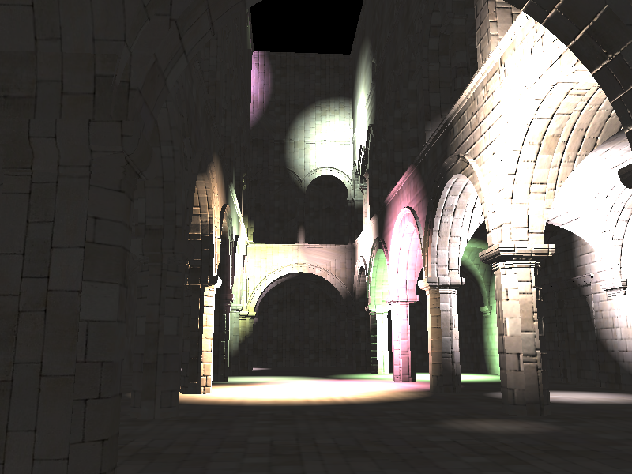](http://megmo21.github.io/Project6-WebGL-Deferred-Shading)

### Demo Video

[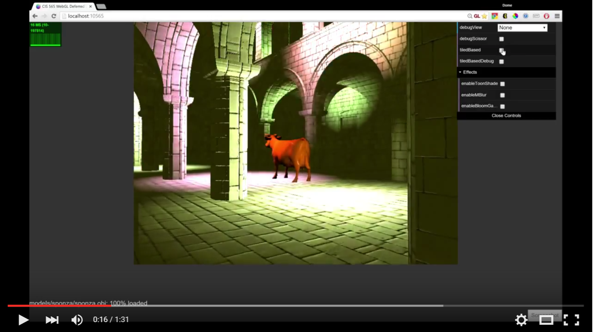](TODO)

In this project, I implemented a deferred
shading pipeline and various lighting and visual effects using WebGL and GLSL.

**Effects:**

* Implement deferred Blinn-Phong shading (diffuse + specular)
  * With normal mapping (code provided)
 
  

  * The Blinn-Phong shading was the first effect implemented. This is a deferred shader and does not use any post processing.  The Blinn-Phong lighting was applied with normal mapping.  

* Implement Bloom using post-process blur 
  * Using post-process blur (Gaussian) [1]
   
 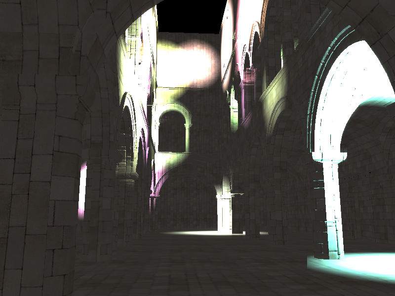

  * Bloom was implemented using a two-pass Gaussian blur.  The first pass allows for the blur to be applied horizontally, while the second allows for the blur to be applied vertically.  By splitting this process up into two passes, we are able to increase the speed of the effect.  Doing this in one pass would require n^2 amount of time, where n is the diameter of the blur.  However, in a two-pass process it only requires 2n.  Overall the bloom effect slightly decreased the speed of the program.  It went from 35 FPS to 29 FPS, causing a drop of 6 FPS.  
 
* Implement Toon shading 
  * With ramp shading and simple depth-edge detection
   
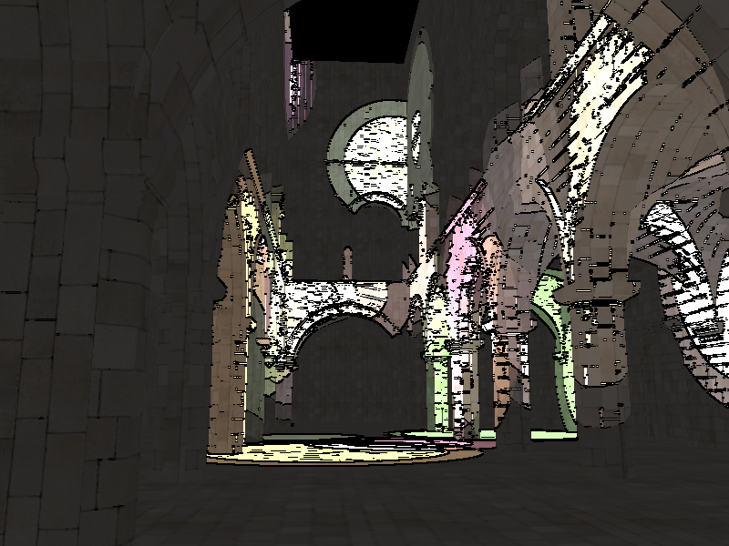
 
  * Toon shading requires just one post process pass.  In order to implement toon shading, the diffuse and specular values in the blinn-phong shading were manipulated to be step functions, rather than continous functions.  If the diffuse term was lower than .5, it became .2.  If it was higher than .5, it became 1.0.  The same was done for the specular value.  This allows for the distinct change in color on the models.  This was all done in the blinn-phong shader.  Then, the edge detection was done in the post-process pass.  The color of 8 neighboring fragments was collected.  If the mix of all those fragments was greater than a certain threshold, it meant that the color was changing and this fragment was on the edge of a material.  Thus, it's color should be changed to black.  This implementation took less time than the bloom implementation, it only slowed down the program by 4 FPS.
  * It took a while to get this implementation correct.  Below are some of the early stage toon images.  At first, the diffuse term was backwards, causing the lights to be very bright on the edge and dark at the center.  Then, I had the correct shading, but no outlines.  
  
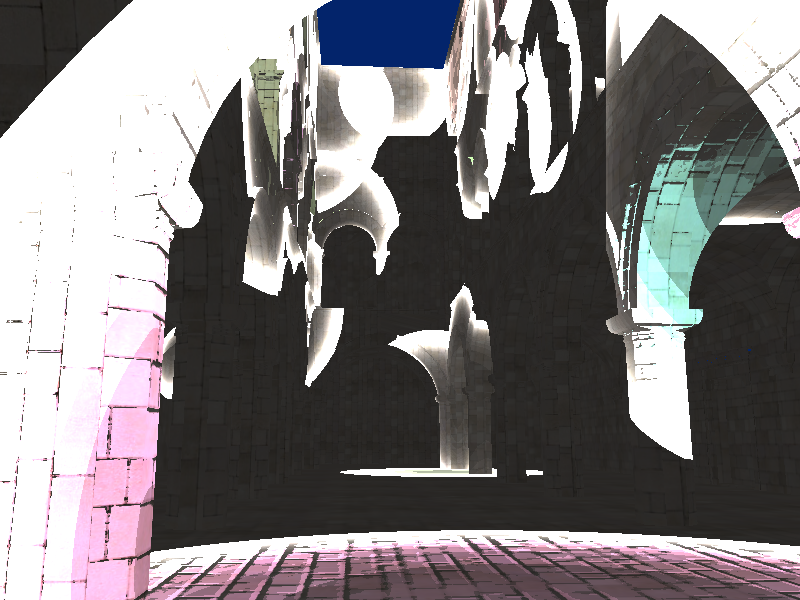 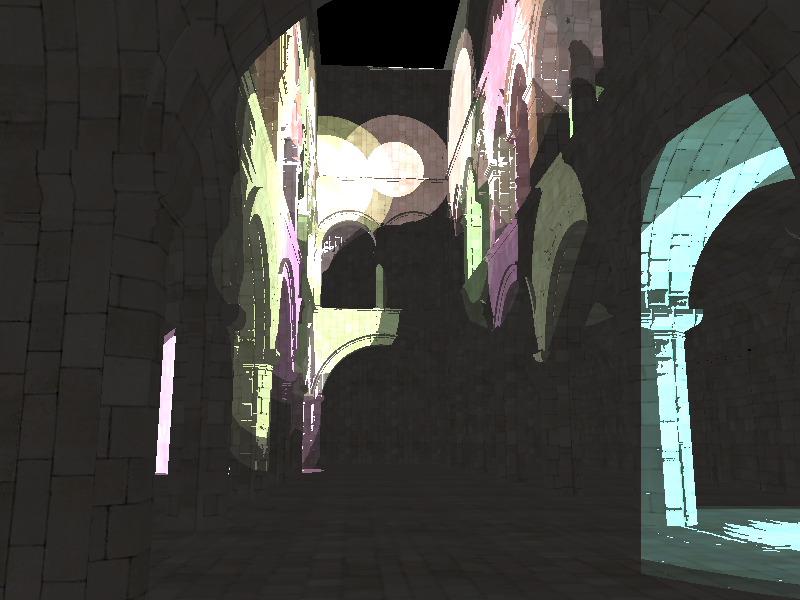

* Allow variability in additional material properties

  * This effect was implemented, by adding an extra variable to each model that was loaded into the scene.  As the model's data was being copied into the GBuffer, the specular exponent that had been loaded with the model, was copied into the fourth element of the normal vector in the GBuffer.  Then it was used in the blinn phong calculations.  This did not add on any extra run-time, as it didn't add to the size of the GBuffers that were being copied and passed into the shaders.  

* Screen-space motion blur [3]

  * This effect was implemented in a post process pass.  The previous frame's camera matrix was kept in a global variable that could be passed into the shader during the next frame.  With that, I am able to calculate the current world coordinates' texture coordinates of the previous frame.  From this, I can calcualte the velocity of the fragment by taking the difference between the two coordinates.  Then, I sample the colors along a vector going in the direction of the velocity.  The average of this sample becomes the new fragment color.  
  * There is also a debug view for this effect.  It shows the velocity (in color) at each fragment.  

**Optimizations:**

* Scissor test optimization, Old and Improved

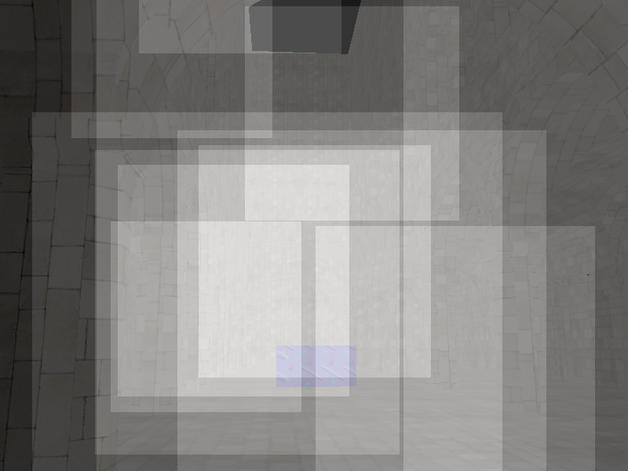 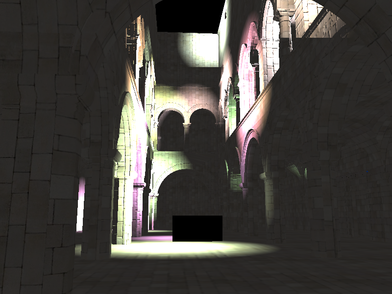

  * This is the original scissor test.  When accumulating shading from each light source, I only want to render in a rectangle around the light.  This helps to increase the run time of our program.  In this case, the scissor test allowed my FPS to go from an average of 14 to 31.  The images above show the debug view, which has all the rectangles that are being rendered, and an image of the actual rendered model.  

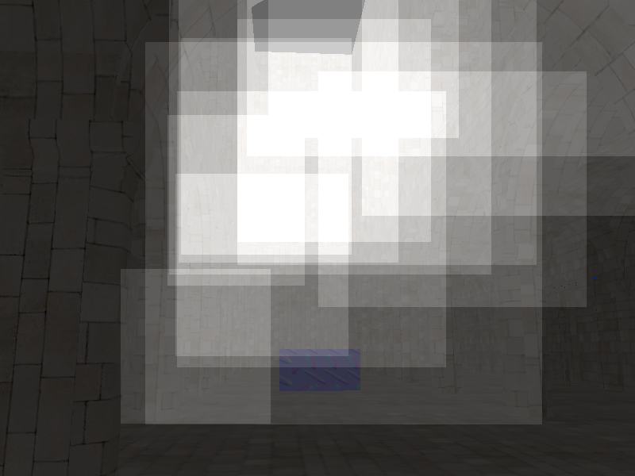 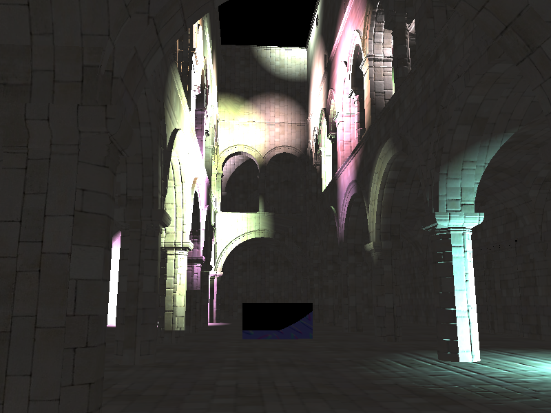
  
  * The scissor test was able to be improved.  By calculating amore precise bounding box, around the entire light sphere, I was able to increase the speed and accuracy of the render.   The speed up was less impressive, but still allowed for the FPS to increase to an average of 35, improving it by 4 FPS.  Also, there are no longer any cut offs on the lights.  You can see on the image on the right, the light in the upper right corner is cut off in the original image, but not in the image directly above.  

* Optimized g-buffer format - reduce the number and size of g-buffers:
  
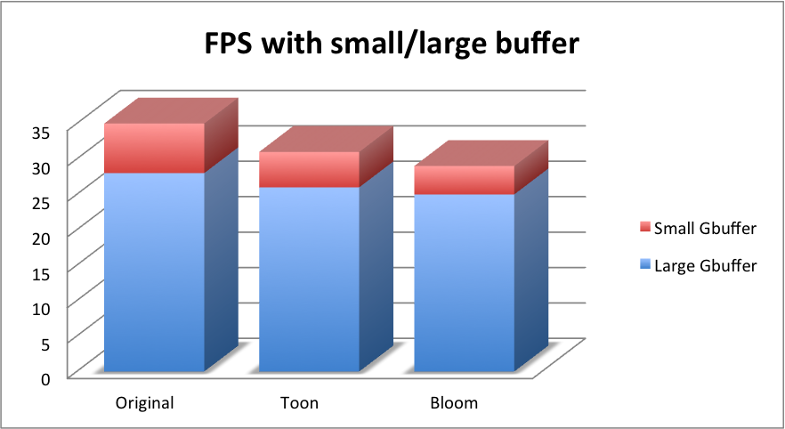

  * In order to reduce the size of the GBuffer, I applied the normal map function during the copy fragment shader, rather than in the ambient, blinn-phong, and debug shaders.  This allowed me not to pass through both the geometry normal and normal map.  I could just pass the surface normal into the shader.  You can see from the graph above, that having a smaller GBuffer size increased the FPS in all cases.  

**Optimizations/Analysis:**

* (2pts) Improved screen-space AABB for scissor test
  (smaller/more accurate than provided - but beware of CPU/GPU tradeoffs)

* (3pts) Two-pass **Gaussian** blur using separable convolution (using a second
  postprocess render pass) to improve bloom or other 2D blur performance

* (4-6pts) Light proxies
  * (4pts) Instead of rendering a scissored full-screen quad for every light,
    render some proxy geometry which covers the part of the screen affected by
    the light (e.g. a sphere, for an attenuated point light).
    * A model called `sphereModel` is provided which can be drawn in the same
      way as the code in `drawScene`. (Must be drawn with a vertex shader which
      scales it to the light radius and translates it to the light position.)
  * (+2pts) To avoid lighting geometry far behind the light, render the proxy
    geometry (e.g. sphere) using an inverted depth test
    (`gl.depthFunc(gl.GREATER)`) with depth writing disabled (`gl.depthMask`).
    This test will pass only for parts of the screen for which the backside of
    the sphere appears behind parts of the scene.
    * Note that the copy pass's depth buffer must be bound to the FBO during
      this operation!
  * Show a debug view for this (showing light proxies)
  * Compare performance of this, naive, and scissoring.

* (8pts) Tile-based deferred shading with detailed performance comparison
  * On the CPU, check which lights overlap which tiles. Then, render each tile
    just once for all lights (instead of once for each light), applying only
    the overlapping lights.
    * The method is described very well in
      [Yuqin & Sijie's README](https://github.com/YuqinShao/Tile_Based_WebGL_DeferredShader/blob/master/README.md#algorithm-details).
    * This feature requires allocating the global light list and tile light
      index lists as shown at this link. These can be implemented as textures.
  * Show a debug view for this (number of lights per tile)

* (6pts) Deferred shading without multiple render targets
  (i.e. without WEBGL_draw_buffers).
  * Render the scene once for each target g-buffer, each time into a different
    framebuffer object.
  * Include a detailed performance analysis, comparing with/without
    WEBGL_draw_buffers (like in the
    [Mozilla blog article](https://hacks.mozilla.org/2014/01/webgl-deferred-shading/)).

* (2-6pts) Compare performance to equivalently-lit forward-rendering:
  * (2pts) With no forward-rendering optimizations
  * (+2pts) Coarse, per-object back-to-front sorting of geometry for early-z
    * (Of course) must render many objects to test
  * (+2pts) Z-prepass for early-z

This extra feature list is not comprehensive. If you have a particular idea
that you would like to implement, please **contact us first** (preferably on
the mailing list).

**Where possible, all features should be switchable using the GUI panel in
`ui.js`.**

### Performance & Analysis

**Before doing performance analysis,** you must disable debug mode by changing
`debugMode` to `false` in `framework.js`. Keep it enabled when developing - it
helps find WebGL errors *much* more easily.

Optimize your JavaScript and/or GLSL code. Web Tracing Framework
and Chrome/Firefox's profiling tools (see Resources section) will
be useful for this. For each change
that improves performance, show the before and after render times.

For each new *effect* feature (required or extra), please
provide the following analysis:

* Concise overview write-up of the feature.
* Performance change due to adding the feature.
  * If applicable, how do parameters (such as number of lights, etc.)
    affect performance? Show data with simple graphs.
* If you did something to accelerate the feature, what did you do and why?
* How might this feature be optimized beyond your current implementation?

For each *performance* feature (required or extra), please provide:

* Concise overview write-up of the feature.
* Detailed performance improvement analysis of adding the feature
  * What is the best case scenario for your performance improvement? What is
    the worst? Explain briefly.
  * Are there tradeoffs to this performance feature? Explain briefly.
  * How do parameters (such as number of lights, tile size, etc.) affect
    performance? Show data with graphs.
  * Show debug views when possible.
    * If the debug view correlates with performance, explain how.

Note: Be aware that stats.js may give 0 millisecond frame timings in Chrome on
occasion - if this happens, you can use the FPS counter.

### Starter Code Tour

You'll be working mainly in `deferredRender.js` using raw WebGL. Three.js is
included in the project for various reasons. You won't use it for much, but its
matrix/vector types may come in handy.

It's highly recommended that you use the browser debugger to inspect variables
to get familiar with the code. At any point, you can also
`console.log(some_var);` to show it in the console and inspect it.

The setup in `deferredSetup` is already done for you, for many of the features.
If you want to add uniforms (textures or values), you'll change them here.
Therefore, it is recommended that you review the comments to understand the
process, BEFORE starting work in `deferredRender`.

In `deferredRender`, start at the **START HERE!** comment.
Work through the appropriate **`TODO`s** as you go - most of them are very
small. Test incrementally (after implementing each part, instead of testing
all at once).

Your first goal should be to get the debug views working.
Add code in `debug.frag.glsl` to examine your g-buffers before trying to
render them. (Set the debugView in the UI to show them.)

For editing JavaScript, you can use a simple editor with syntax highlighting
such as Sublime, Vim, Emacs, etc., or the editor built into Chrome.

* `js/`: JavaScript files for this project.
  * `main.js`: Handles initialization of other parts of the program.
  * `framework.js`: Loads the scene, camera, etc., and calls your setup/render
    functions. Hopefully, you won't need to change anything here.
  * `deferredSetup.js`: Deferred shading pipeline setup code.
    * `createAndBind(Depth/Color)TargetTexture`: Creates empty textures for
      binding to frame buffer objects as render targets.
  * `deferredRender.js`: Your deferred shading pipeline execution code.
    * `renderFullScreenQuad`: Renders a full-screen quad with the given shader
      program.
  * `ui.js`: Defines the UI using
    [dat.GUI](https://workshop.chromeexperiments.com/examples/gui/).
    * The global variable `cfg` can be accessed anywhere in the code to read
      configuration values.
  * `utils.js`: Utilities for JavaScript and WebGL.
    * `abort`: Aborts the program and shows an error.
    * `loadTexture`: Loads a texture from a URL into WebGL.
    * `loadShaderProgram`: Loads shaders from URLs into a WebGL shader program.
    * `loadModel`: Loads a model into WebGL buffers.
    * `readyModelForDraw`: Configures the WebGL state to draw a model.
    * `drawReadyModel`: Draws a model which has been readied.
    * `getScissorForLight`: Computes an approximate scissor rectangle for a
      light in world space.
* `glsl/`: GLSL code for each part of the pipeline:
  * `clear.*.glsl`: Clears each of the `NUM_GBUFFERS` g-buffers.
  * `copy.*.glsl`: Performs standard rendering without any fragment shading,
    storing all of the resulting values into the `NUM_GBUFFERS` g-buffers.
  * `quad.vert.glsl`: Minimal vertex shader for rendering a single quad.
  * `deferred.frag.glsl`: Deferred shading pass (for lighting calculations).
    Reads from each of the `NUM_GBUFFERS` g-buffers.
  * `post1.frag.glsl`: First post-processing pass.
* `lib/`: JavaScript libraries.
* `models/`: OBJ models for testing. Sponza is the default.
* `index.html`: Main HTML page.
* `server.bat` (Windows) or `server.py` (OS X/Linux):
  Runs a web server at `localhost:10565`.

### The Deferred Shading Pipeline

See the comments in `deferredSetup.js`/`deferredRender.js` for low-level guidance.

In order to enable and disable effects using the GUI, upload a vec4 uniform
where each component is an enable/disable flag. In JavaScript, the state of the
UI is accessible anywhere as `cfg.enableEffect0`, etc.

**Pass 1:** Renders the scene geometry and its properties to the g-buffers.
* `copy.vert.glsl`, `copy.frag.glsl`
* The framebuffer object `pass_copy.fbo` must be bound during this pass.
* Renders into `pass_copy.depthTex` and `pass_copy.gbufs[i]`, which need to be
  attached to the framebuffer.

**Pass 2:** Performs lighting and shading into the color buffer.
* `quad.vert.glsl`, `deferred/blinnphong-pointlight.frag.glsl`
* Takes the g-buffers `pass_copy.gbufs`/`depthTex` as texture inputs to the
  fragment shader, on uniforms `u_gbufs` and `u_depth`.
* `pass_deferred.fbo` must be bound.
* Renders into `pass_deferred.colorTex`.

**Pass 3:** Performs post-processing.
* `quad.vert.glsl`, `post/one.frag.glsl`
* Takes `pass_BlinnPhong_PointLight.colorTex` as a texture input `u_color`.
* Renders directly to the screen if there are no additional passes.

More passes may be added for additional effects (e.g. combining bloom with
motion blur) or optimizations (e.g. two-pass Gaussian blur for bloom)

#### Debugging

If there is a WebGL error, it will be displayed on the developer console and
the renderer will be aborted. To find out where the error came from, look at
the backtrace of the error (you may need to click the triangle to expand the
message). The line right below `wrapper @ webgl-debug.js` will point to the
WebGL call that failed.

#### Changing the number of g-buffers

Note that the g-buffers are just `vec4`s - you can put any values you want into
them. However, if you want to change the total number of g-buffers (add more
for additional effects or remove some for performance), you will need to make
changes in a number of places:

* `deferredSetup.js`/`deferredRender.js`: search for `NUM_GBUFFERS`
* `copy.frag.glsl`
* `deferred.frag.glsl`
* `clear.frag.glsl`

## Resources

* [1] Bloom:
  [GPU Gems, Ch. 21](http://http.developer.nvidia.com/GPUGems/gpugems_ch21.html) 
* [2] Screen-Space Ambient Occlusion:
  [Floored Article](http://floored.com/blog/2013/ssao-screen-space-ambient-occlusion.html)
* [3] Post-Process Motion Blur:
  [GPU Gems 3, Ch. 27](http://http.developer.nvidia.com/GPUGems3/gpugems3_ch27.html)

**Also see:** The articles linked in the course schedule.

### Profiling and debugging tools

Built into Firefox:
* Canvas inspector
* Shader Editor
* JavaScript debugger and profiler

Built into Chrome:
* JavaScript debugger and profiler

Plug-ins:
* (Chrome/Firefox) [Web Tracing Framework](http://google.github.io/tracing-framework/)
* (Chrome) [Shader Editor](https://chrome.google.com/webstore/detail/shader-editor/ggeaidddejpbakgafapihjbgdlbbbpob)

Firefox can also be useful - it has a canvas inspector, WebGL profiling and a
shader editor built in.

## README

Replace the contents of this README.md in a clear manner with the following:

* A brief description of the project and the specific features you implemented.
* At least one screenshot of your project running.
* A 30+ second video of your project running showing all features.
  [Open Broadcaster Software](http://obsproject.com) is recommended.
  (Even though your demo can be seen online, using multiple render targets
  means it won't run on many computers. A video will work everywhere.)
* A performance analysis (described below).

### Performance Analysis

See above.

### GitHub Pages

Since this assignment is in WebGL, you can make your project easily viewable by 
taking advantage of GitHub's project pages feature.

Once you are done with the assignment, create a new branch:

`git branch gh-pages`

Push the branch to GitHub:

`git push origin gh-pages`

Now, you can go to `<user_name>.github.io/<project_name>` to see your
renderer online from anywhere. Add this link to your README.

## Submit

1. Open a GitHub pull request so that we can see that you have finished.
   The title should be "Submission: YOUR NAME".
   * **ADDITIONALLY:**
     In the body of the pull request, include a link to your repository.
2. Send an email to the TA (gmail: kainino1+cis565@) with:
   * **Subject**: in the form of `[CIS565] Project N: PENNKEY`.
   * Direct link to your pull request on GitHub.
   * Estimate the amount of time you spent on the project.
   * If there were any outstanding problems, briefly explain.
   * **List the extra features you did.**
   * Feedback on the project itself, if any.

### Third-Party Code Policy

* Use of any third-party code must be approved by asking on our mailing list.
* If it is approved, all students are welcome to use it. Generally, we approve
  use of third-party code that is not a core part of the project. For example,
  for the path tracer, we would approve using a third-party library for loading
  models, but would not approve copying and pasting a CUDA function for doing
  refraction.
* Third-party code **MUST** be credited in README.md.
* Using third-party code without its approval, including using another
  student's code, is an academic integrity violation, and will, at minimum,
  result in you receiving an F for the semester.
