WebGL Deferred Shading
======================

**University of Pennsylvania, CIS 565: GPU Programming and Architecture, Project 6**

* Ziye
* Tested on: Google Chrome 41.0.2272.89 m on Windows 10, i7-4710MQ @ 2.50GHz 32GB, AMD HD8970M (Personal Laptop)

### Demo Video

##Progress
======================
###Debug View

Here I generate the simple debug view by visualize the data pass from the copy shader, which use different properties (depth, color, position, normal, etc.) as different texture to pass for later processing.

* Depth Map

* Color Map
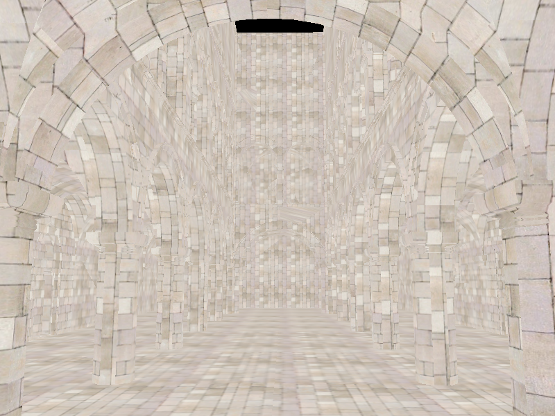
* Position Map
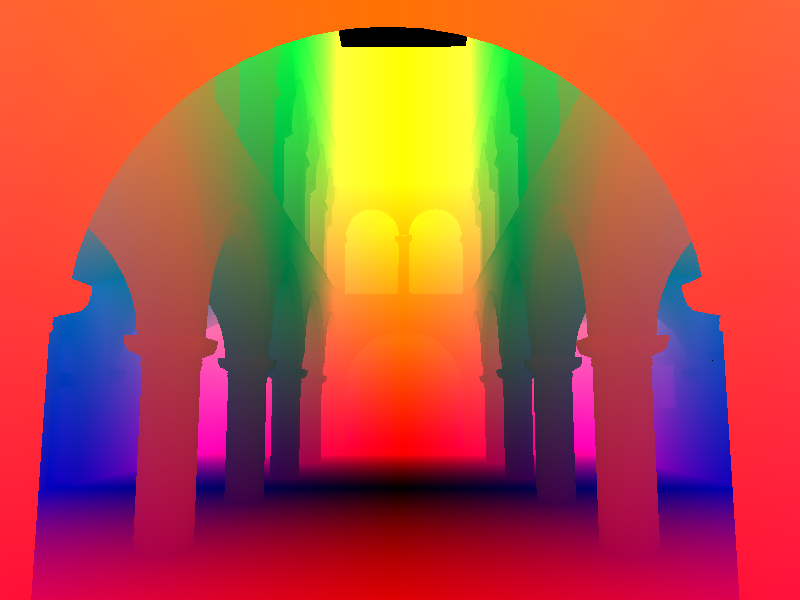
* Normal Map
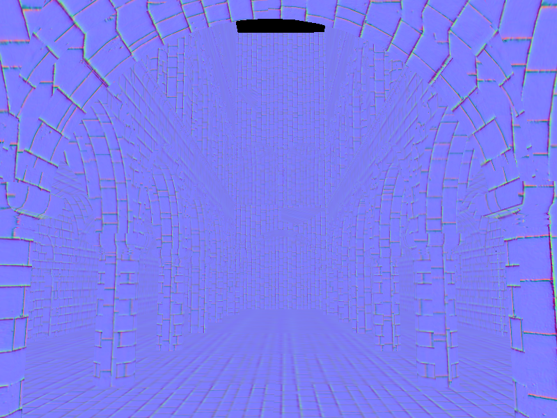
* Geometry Normal
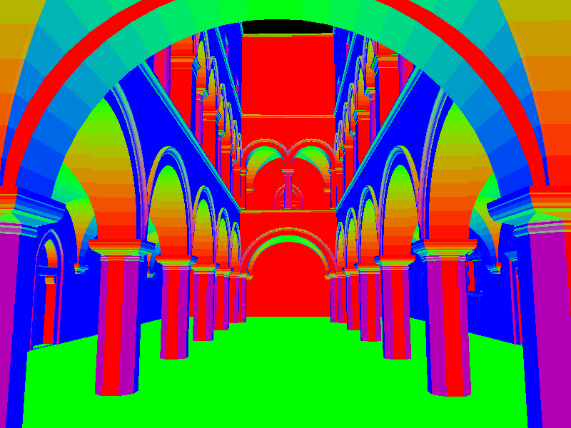
* Surface Normal Map
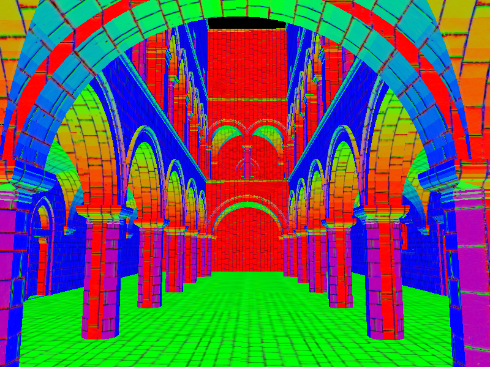

### Lightning
* Ambient Light

I am using the global light with distance attenuation to generate the ambient light effect. As can be seen from the image below, the farther the distance, the darker it is.

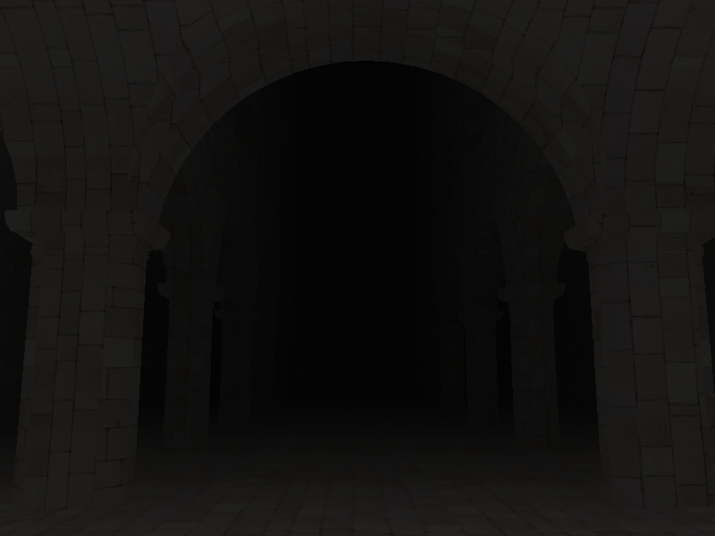
* Bling Phong
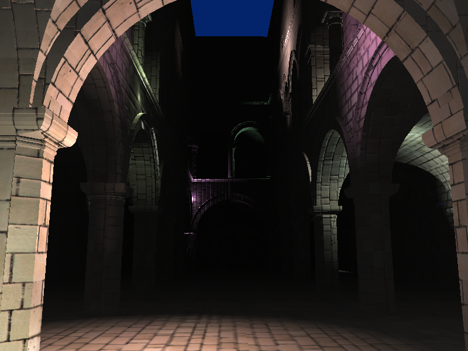

### Special Effects
* Bloom
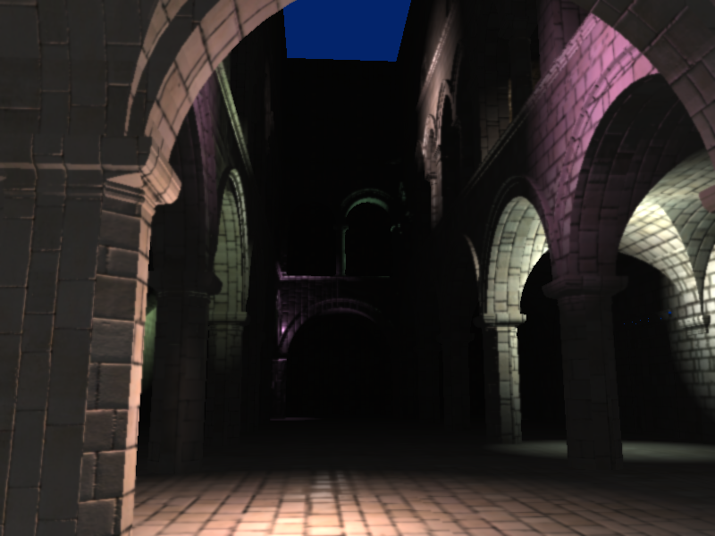
* Toon
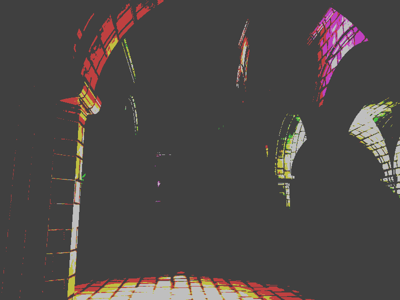

### Optimization
* Without G-Buffer Optimization
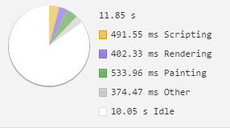

* With G-Buffer Optimization
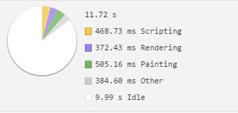

*Scissor test
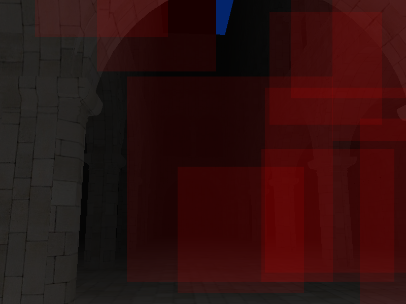

