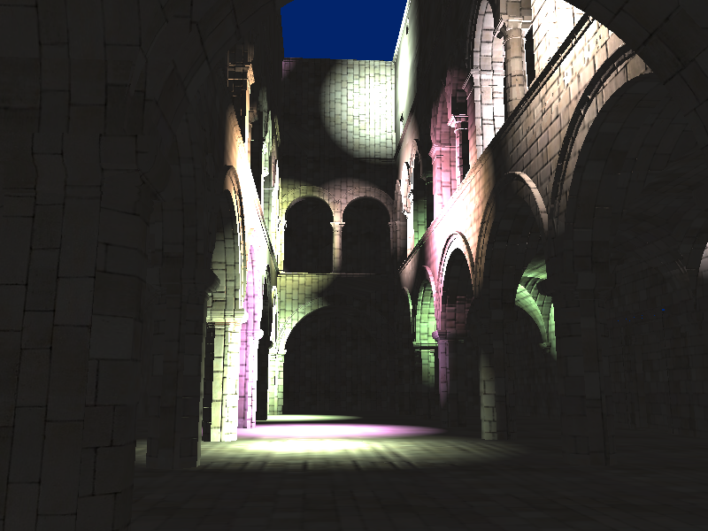

WebGL Deferred Shading
======================

**University of Pennsylvania, CIS 565: GPU Programming and Architecture, Project 6**

* Sanchit Garg
* Tested on: Safari Version 9.0.1 on
  Mac OSX 10.10.4, i7 @ 2.4 GHz, GT 650M 1GB (Personal Computer)

### Live Online

### Demo Video

### Deferred Shader

