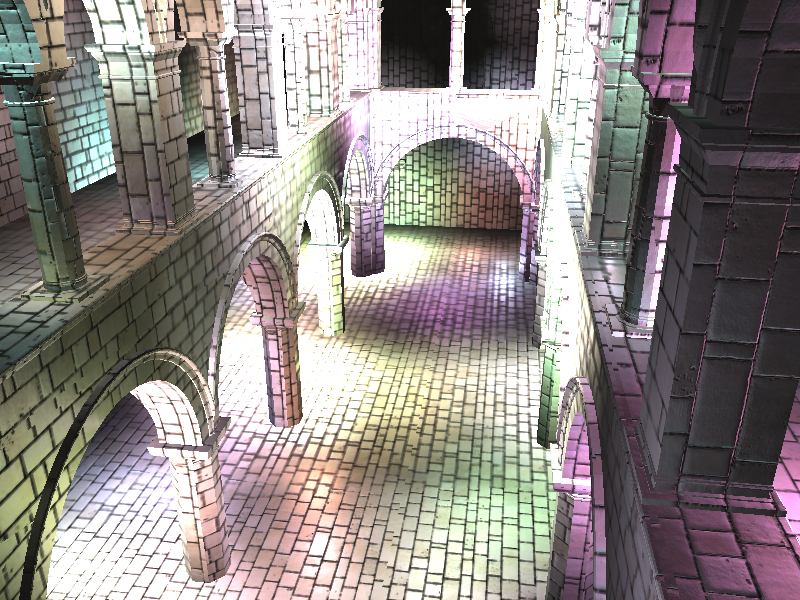
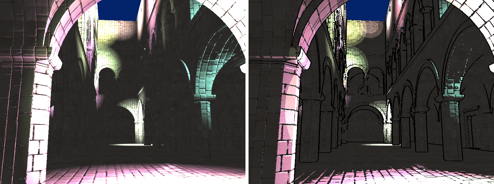
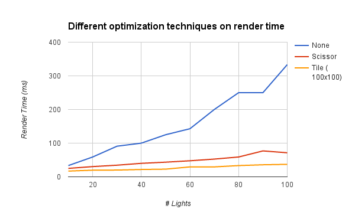
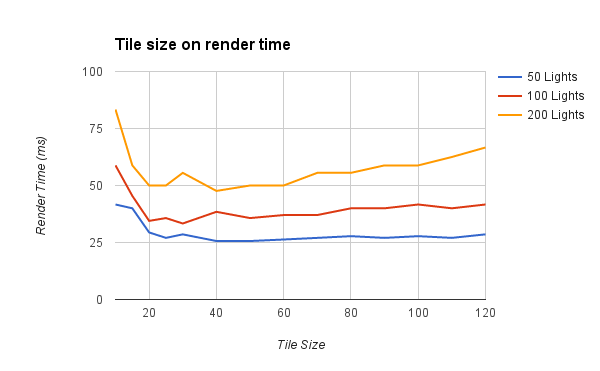
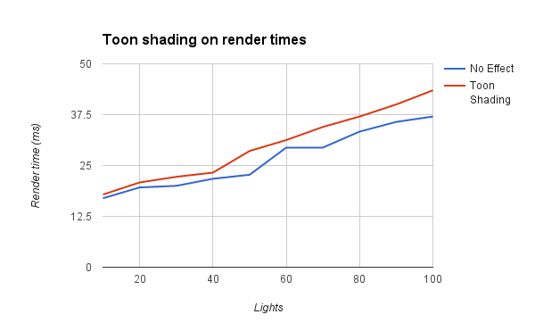

WebGL Deferred Shading
======================

**University of Pennsylvania, CIS 565: GPU Programming and Architecture, Project 6**

Terry Sun; Arch Linux, Intel i7-4600, integrated graphics

A tile-based deferred shader.

Check it out: [live online](http://terrysun.blue/WebGL-Deferred-Shader/)!
There are a lot of available sliders and options for
you to play with.

Showing 300 lights at a tile size of 75x75, rendering in about 80ms.

## Tile

This tile-based shader technique "inverts" the deferred shader step: rather than
drawing to the entire scene once per each light, the scene is drawn in
individual tiles, and each tile loops over the lights that intersect it.

(Figure from [Tiled Shading](http://www.cse.chalmers.se/~uffe/tiled_shading_preprint.pdf))

Inspiration for texture layout was taken from the image above, which a few
modifications: the global light list was stored as two separate textures with
corresponding indices (one containing position and radius; the other containing
light colors). The "tile light light indices" texture, which stored the list of
lights for each tile, packed closely, was not an Nx1 texture but a 4092xM
texture, expanding to allow larger lists of indices. (The light grid, however,
never exceeded an Nx1 size.)

This technique will render 300 lights in ~66 ms and 400 lights in ~76 ms. (See
below for more information.)

## Toon Shading

In addition to Blinn-Phong lighting, this shader implements a non-photorealistic
toon shader. This consists of two main effects:

* Discretization of color values, which mimicks a hand-drawn or hand-colored
  shading style. This is a simple post-processing step (though not a separate
  deferred pipeline step) where the calculated Blinn-Phong light value is
  floored to the nearest color "edge".
* Edge shading applies a bolding effect on the edges of geometry, calculated by
  sampling the depth texture at a fragment's neighbors. If the maximum depth
  *difference* is greater than some threshold, then consider the fragment to lie
  on an edge and shade it black. The edge can be made thicker by sampling pixels
  which lie farther away.

### Watercolor

Actually a cool blooper: this is what happens if you discretize over the *sum*
of colors in a tile rather than each individual light.

(Currently, supported on tile-based deferred shading only. On non-tile-based
shading, this would have to be a post-processing step.)

## Performance

Performance numbers were taken with stats.js, with the camera placed inside the
scene and lights evenly distributed within the scene such that almost all of
them are within view of the camera.

This results are similar to 

The tile size actually doesn't have a particularly large effect at lower light
counts. Here, the performance gain of partitioning fewer lights per tile (and
decreasing the amount of time looping through lights on the GPU) is counteracted
by the amount of work needed to compute the lights-per-tile partition texture on
the CPU, leaving the time relatively consistent for many tile sizes between
40x40 and 100x100. The timing at about 30x30 is particularly inconsistent --
perhaps this is one place where the CPU/GPU tradeoff is close to even. At tile
sizes smaller than 20x20, you might expect there to be few lights per tile, it
takes quite a lot of time in order to generate the necessary textures (which are
themselves much larger).

With larger numbers of lights in the scene, larger tile sizes also see a large
hit to performance due to looping over lights in the fragment shader. With
fewer lights, this takes much longer (not shown) to manifest as a problem.

At higher light counts, the majority of the time is spent on the CPU computing
light textures. This is verified by using the Chome Profiling tool, which shows
that a significantly higher percentage of time is spent in the texture
computation function (~75% at 300 lights, ~50% at 30 lights) at more brightly
lit scenes. With fewer lights in the scene, a much smaller percentage of time is
spent on the CPU. I suspect that that the actual ms-per-frame spent on the GPU
rises at a much slower rate per light than on the CPU, accounting for the large
difference in relative time on each procesing unit.

Comparison take with 50x50-size tiles.

The main performance cost of toon shading is the additional texture accesses
required to find edges, as each pixel must read four neighbors' depth values.
The discretization of light values should add almost no cost, since it is
implemented as a simple mathematical funciton.

## References

* [Toon Shading WikiBooks](https://en.wikibooks.org/wiki/GLSL_Programming/Unity/Toon_Shading)
* Tile-based Deferred Shading
  * [Mozilla Deferred Shading Article](https://hacks.mozilla.org/2014/01/webgl-deferred-shading/)
  * [Yuqin & Sijie's README](https://github.com/YuqinShao/Tile_Based_WebGL_DeferredShader/blob/master/README.md#algorithm-details).
  * [Tiled Shading](http://www.cse.chalmers.se/~uffe/tiled_shading_preprint.pdf)
