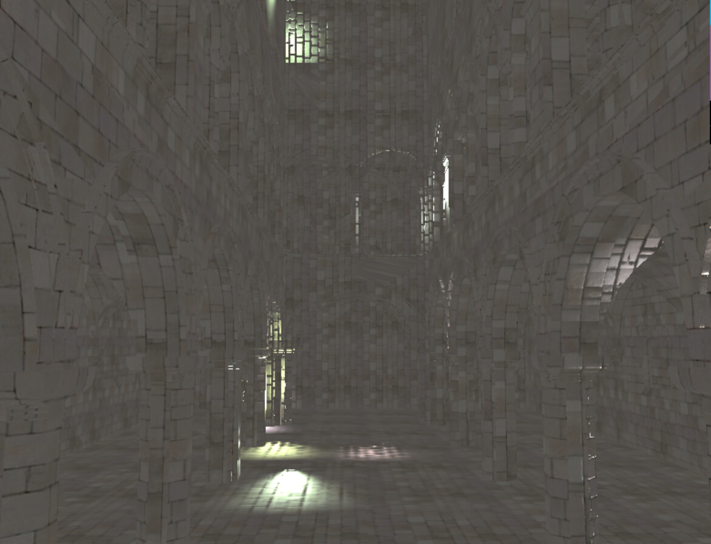
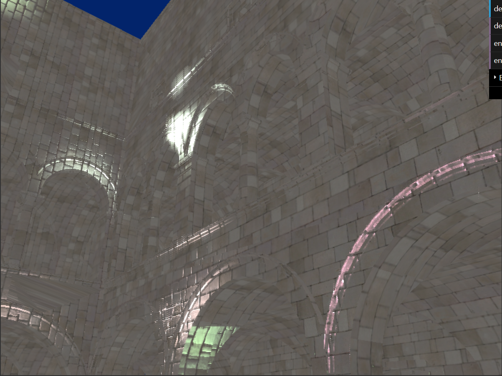
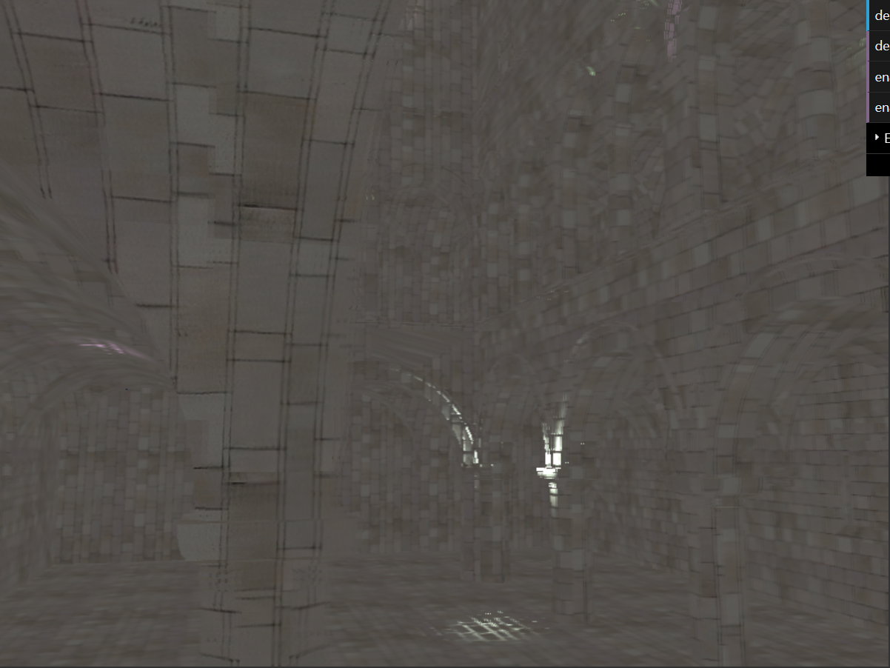
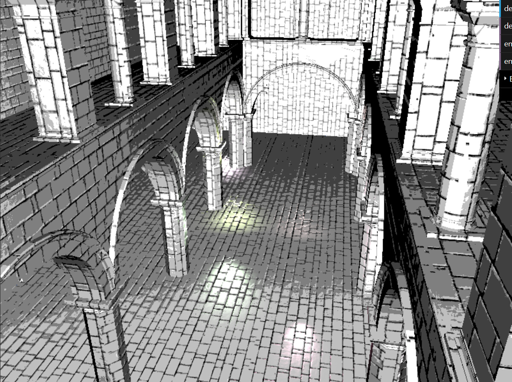
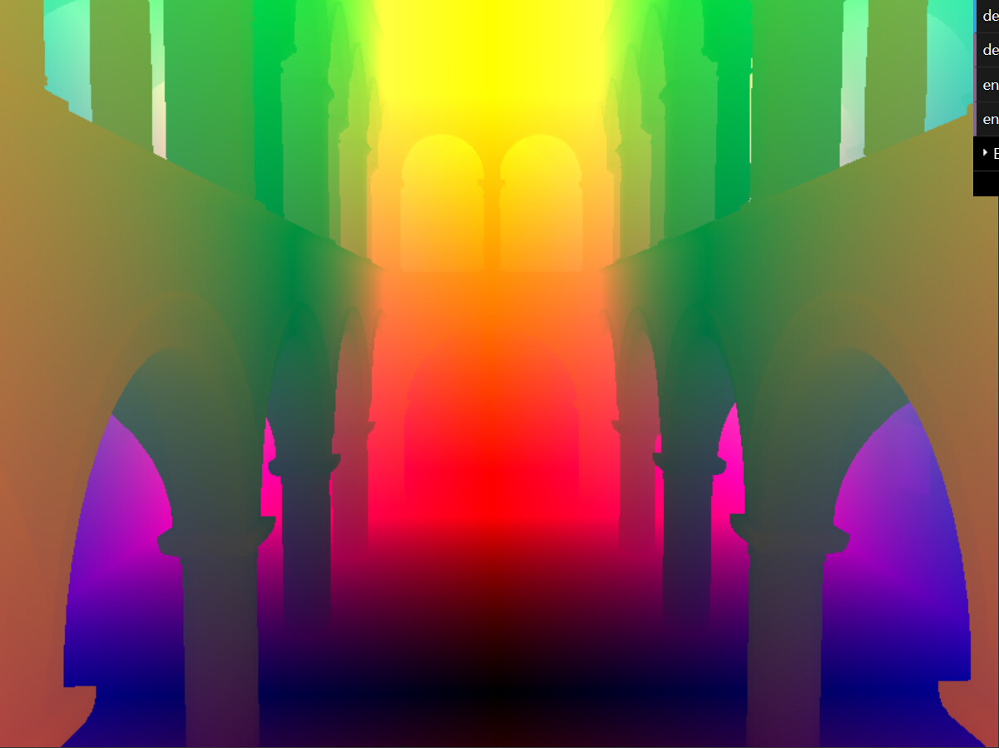
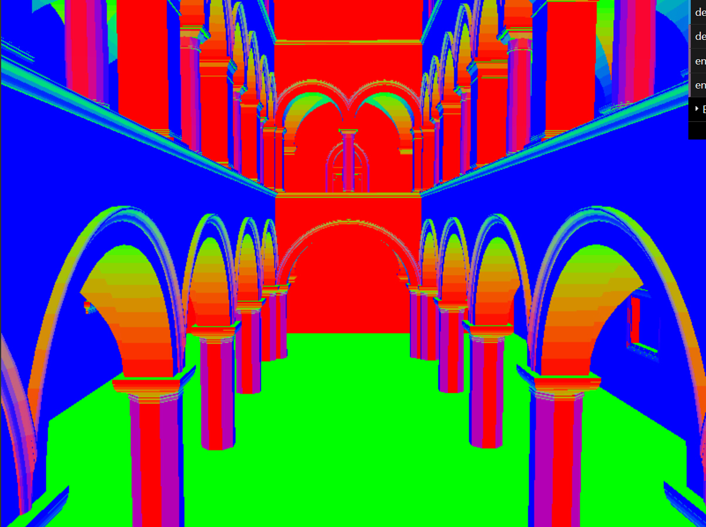
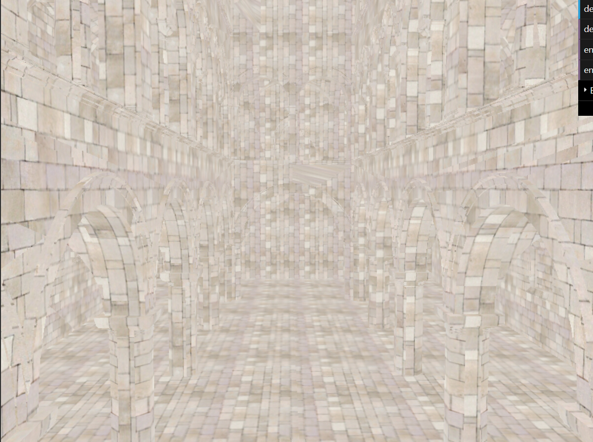
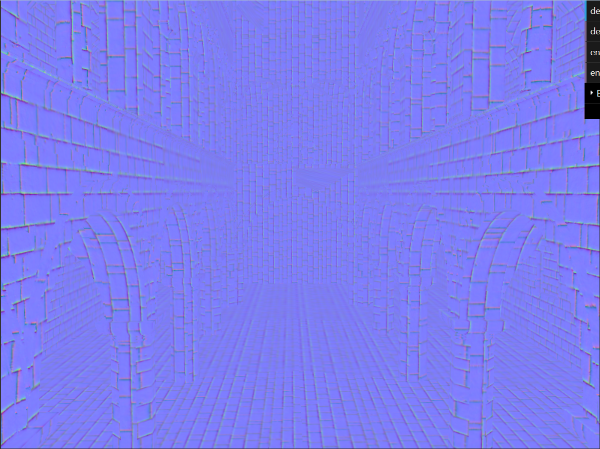
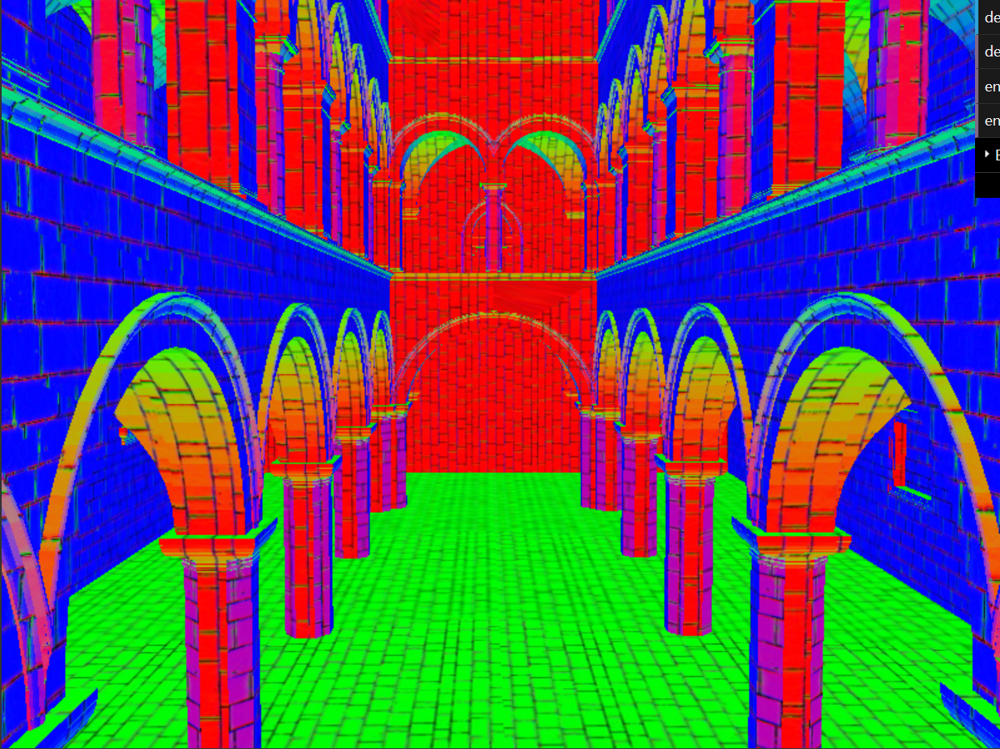

WebGL Deferred Shading
======================

**University of Pennsylvania, CIS 565: GPU Programming and Architecture, Project 6**

siqi Huang Tested on: Windows 7, Inter(R) Core(TM) i7-4870 HQ CPU@ 2.5GHz; GeForce GT 750M(GK107) (Personal Computer)

#Representative Images:

#Part O: Browser Setup
This should be a very easy part, as many browser nowadays support WebGl 1.0 or higher. But in my case I still have problems and spend a whole day dealing with it. First I tried to use Chrome but it seems that it only support WebGl 1.0. To enable the WebGl 2.0, you have to add parameter in its command line[1]. This method work fine in majority of time, but unlucky I am not in that range, so I turn to FireFox and setup the browser for WebGl.

#Part I: Simple Red Squad
For this part I still used much time. Really not familiar with the js function. In general, what I did is create and bind buffer, give point location to shader and render. After all this, the dark screen is in red.

#Part II: Debug Views
After pass value to the copy.vert.glsl. All debug view is easy to get.

1 Depth: Simply use depth value to render.

2 Position: Simply use position to render

3 Geometry Normal: Simply use geometry normal to render

4 Color Map: Simply use color map to render

5 Normal Map: Simply use normal map to render

6 Surface Normal: Use normal map*geometry normal to render

