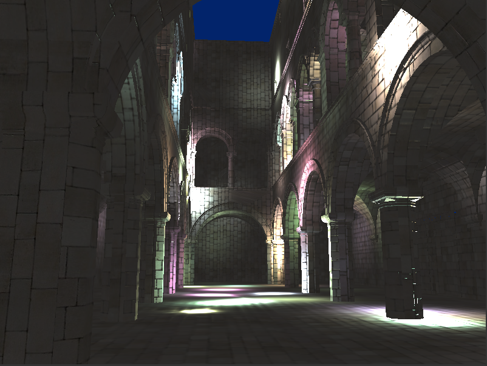
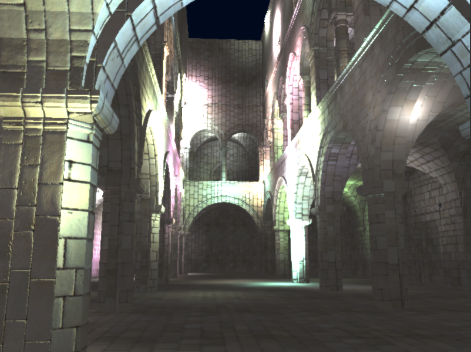
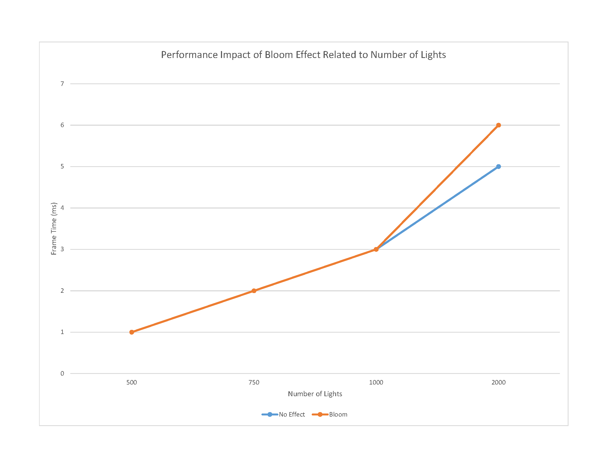
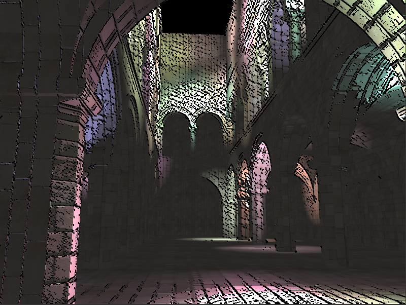
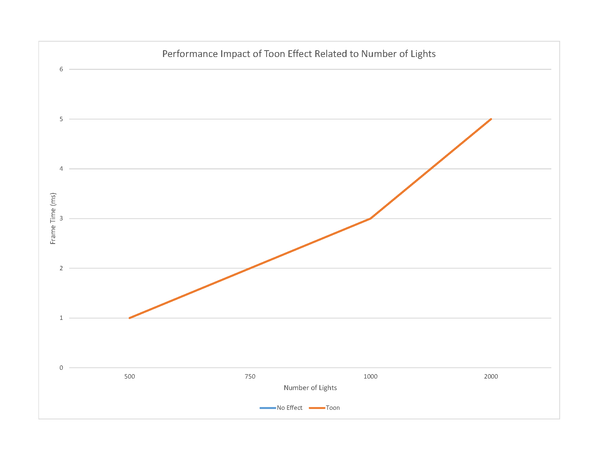
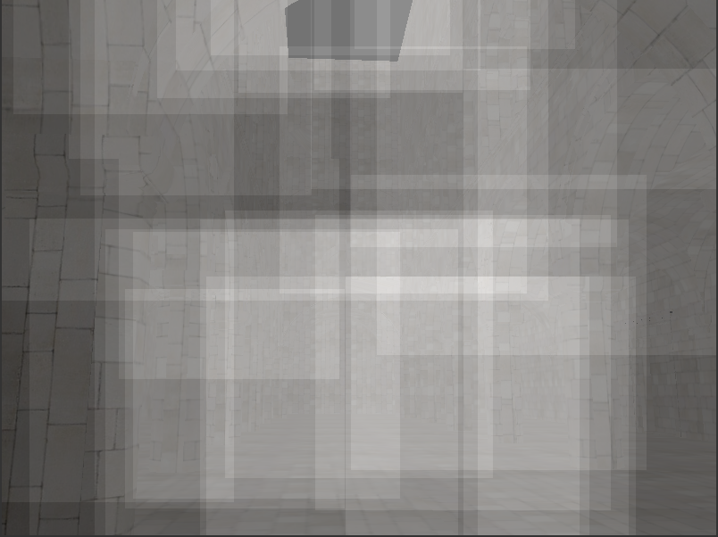
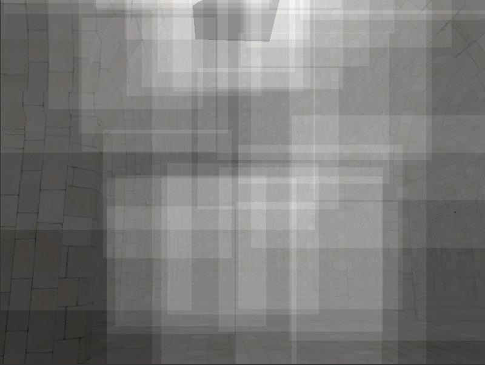
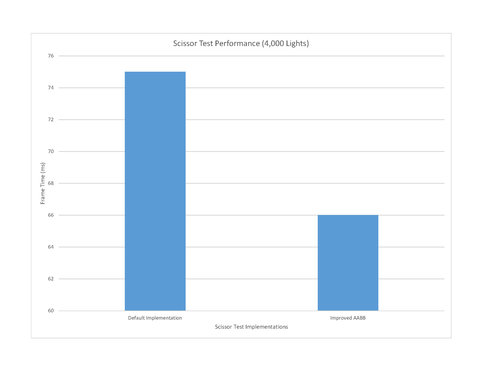
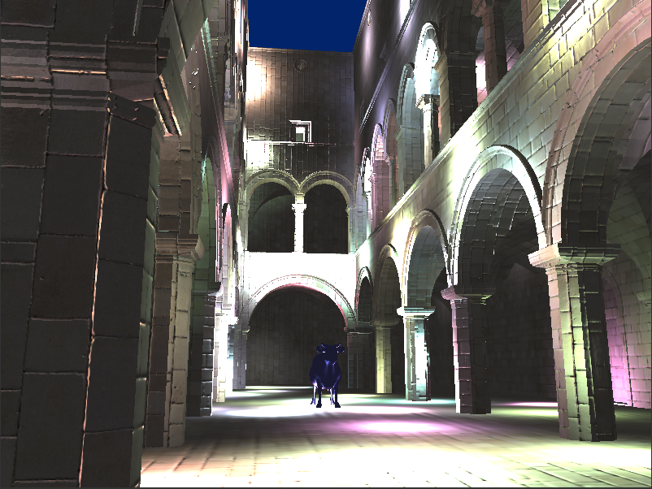

WebGL Deferred Shading
======================

**University of Pennsylvania, CIS 565: GPU Programming and Architecture, Project 6**

* Bradley Crusco
* Tested on: Google Chrome 46 on Windows 10, i7-3770K @ 3.50GHz 16GB, 2 x GTX 980 4096MB (Personal Computer)

### Live Online

### Demo Video

## Description

## Features

### Deferred Blinn-Phong Shading

* **Overview**: Standard Blinn-Phong shader with support for normal maps.
* **Optimization**: Performance was improved by offloading surface normal calculations to the copy shader. See [G-Buffer Optimization](#g-buffer-optimization) for more information.

### Bloom Shading with Two-Pass Gaussian Blur

* **Overview**: Two-pass Gaussian blur to simulate the bloom glow effect.
* **Performance Impact**: Minimal on my machine. In the below chart you can see that there is no measurable impact on performance until we hit 2,000 lights in the scene. At this point we see a 1ms increase, still very small considering the number of light sources.
* **Optimization**: Two-pass Gaussian blur is used instead of a single convolution pass. This helps keep the performance impact minimal. The cost of calculating this blur in a single pass would be d2, where d is the diameter of the blur area. By splitting our convolution into two phases the complexity is reduced to 2d. Unfortunately since this requires an additional render pass there is some added overhead required for memory setup and additional buffer manipulations. Overall the benefit of the two-pass implementation counteracts any negatives.

### Toon Shading

* **Overview**: Toon ramp shading using Sobel operator as an edge detector. 
* **Performance Impact**: No noticable impact. As you can see in the below chart, enabling the toon effect has no impact on performance even with a large number of lights in the scene.
* **Further Improvement**: With regard to performance, there are no improvements I would make because I'm seeing performance numbers in line with the standard Blinn-Phong shading. There are some changes I'd like to make to the visuals of the effect though. Right now the effect is only impacting the point light sources. I also wish to apply the effect to the ambient light as well, so that the toon look will be across the entire scene.

### G-Buffer Optimization
* **Overview**: Pre-calculate the surface normal by applying the normal map in the copy shader pass. This prevents us from having to copy the geometry normals and normal map through the g-buffers.
* **Performance Analysis**: Difficult to objectively analyze, as my frame times are already extremely low. A significant performance increase should be expected though. Removing one g-buffer results in less of a bottle-neck on memory access. Additionally there is computational improvement made by not calculating normals over and over again in the Blinn-Phong shader pass. In practice I saw the frame time drop from 3ms to 2ms in a scene with 1000 lights.

### Scissor Test with AABB Optimizations

#### Original Scissor Test

#### Optimized AABB Scissor Test

* **Overview**: In the optimized version of the scissor test, the AABB is calculated at the light's front-facing maximum circle. This minimizes the distortions that result from transformations and give us smaller, more accurately sized bounding boxes to use for the scissor test. This has performance benefits and eliminates minor artifacts caused by the original implementation.
* **Performance Analysis**: The smaller AABB result in faster scissor test calculations. This impact is especially noticable in scenes with many light sources. Below is the recorded frame times for a scene with 4,000 point lights. With the original implementation, we see 75 ms per frame. With the AABB optimizations we see that drop almost 10 ms to 66 ms per frame, a significant increase in performance. If you look at the two images above you'll see squares representing the AABB being used for the scissor test. In the second image, where the AABB improvements have been made, notice that the boxes have less overlap and are smaller.

### Additional Material Property

#### Multiple Models (Sponza and Cow) with Specular Exponent as a Material Property in G-Buffer

* **Overview**: Specular exponent added as an input to the g-buffers. Passed using the alpha channel of the normal buffer.
* **Performance Impact**: None, cause the exponent is simply passed along the alpha channel of the normal buffer.

## References

* [GPU Gems Chapter 21. Real-Time Glow](http://http.developer.nvidia.com/GPUGems/gpugems_ch21.html)
* [Antialiased Cel Shading](http://prideout.net/blog/?p=22)
* [Sobel Operator](https://en.wikipedia.org/wiki/Sobel_operator)
