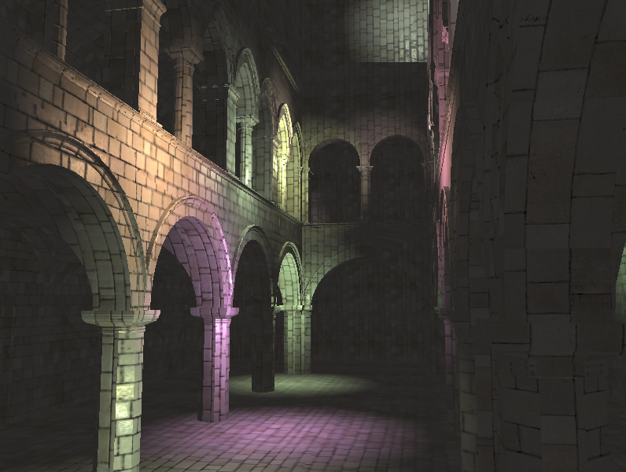
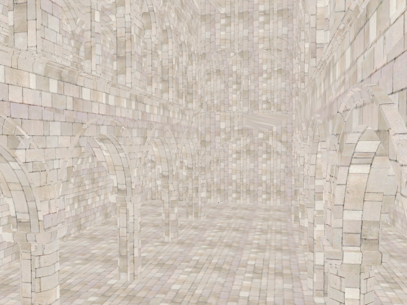
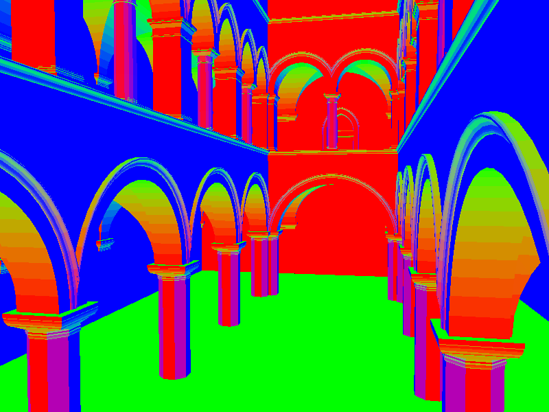
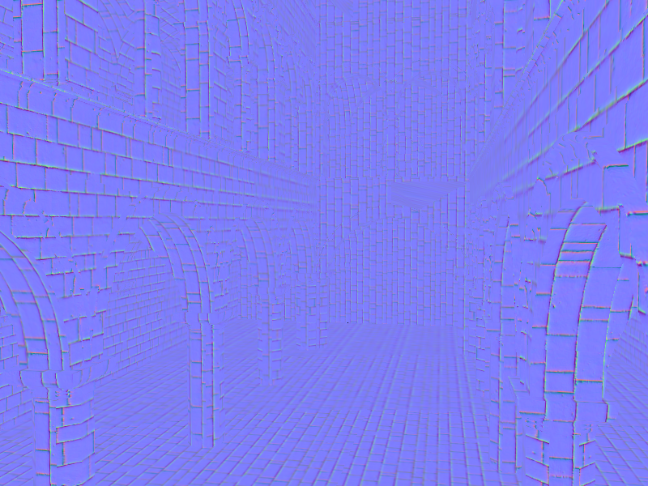
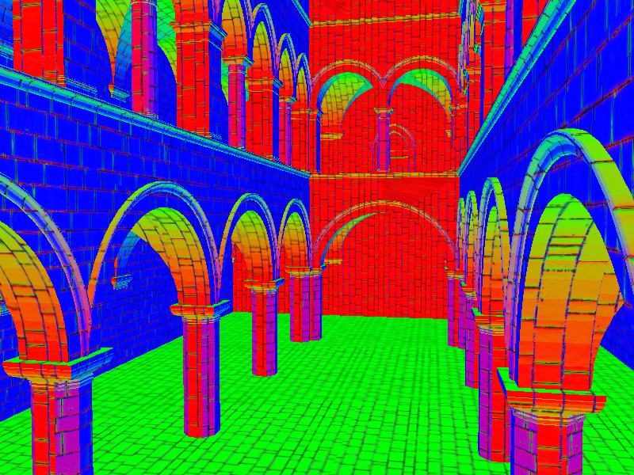
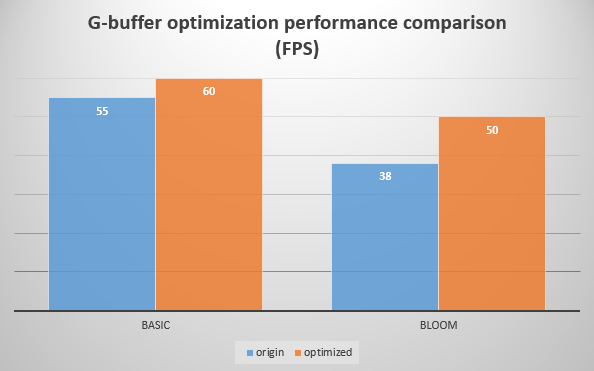
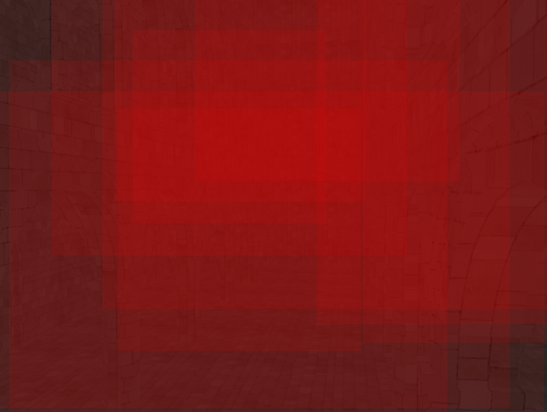
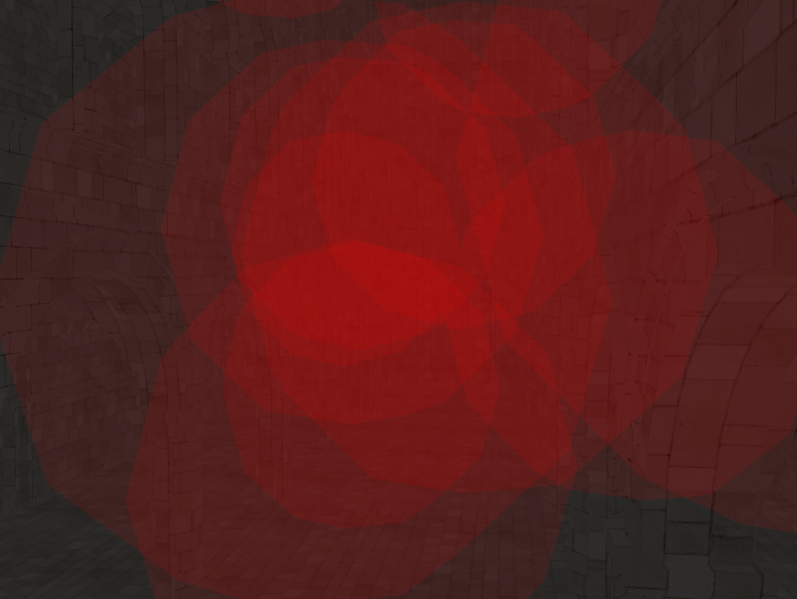
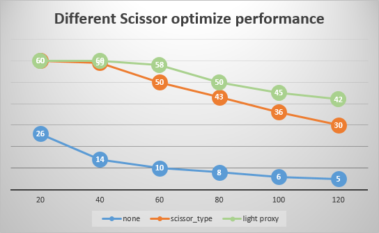

WebGL Deferred Shading
======================

**University of Pennsylvania, CIS 565: GPU Programming and Architecture, Project 5**

* Shuai Shao (Shrek)
* Tested on: **Google Chrome 46.0.2490.71 m** on
  Windows 10, i7-4710HQ @ 2.50GHz 16GB, GeForce GTX 970M (Personal)

### Live Online

### Demo Video

Features 
====================

##### Deferred render

##### Debug Views

|Depth| Geometry Position | Color map|
|--------------------------| --------------------|------|
| | | |
|**Geometry Normal**| **Normal map** | **Surface Normal**|
| | | |

##### Bloom

I used a box filter on the rendered buffer in post-process, to create a glowing effect on the bright part of the deferred render image. 

Two-pass process is used for optimization. By doing this, we decrease the time complexity from N^2 to 2N. This can save memory bandwith. For a 20x20 filter I used, theoratically it takes 10% of the time of one-pass blurring. 

##### Toon

My toon shading consists of two parts. One is ramping the cos value in the Phong shading, which happens right in the deferred shading stage. The other part is drawing the contour, this happens after the image is rendered, by applying a Laplacian filter on the depth buffer, we can get the edge. 

Optimizations
=======================

##### G-Buffer Format

* Normal precomputation
	* Moving the computing of surface normal from deferred step to copy step. Reduce one g-buffer directly. 

* Discard z of normal
	* Since normal vector is always normalized, we only need x and y to reconstruct the normal vector. We can save one float by doing so, which can make enough space for color compacting and other features like screen movements(though not implemented this time). 

* Color packing
	* Because color value has a limited range from 0-255 (if stored as int), we can pack the four color channel into one float using some encoding algorithm, and decode it in the deferred stage. 
	* However, color compacting can lose information, resulting in a relatively noisy color map. When I first use Aras compacting method, it is super noisy which is almost useless. By reading StoneBird's post, it's the issue with precision issue of glsl float. It can be fixed by changing the shifting amount. 

Finally, I manage to reduce the number of g-buffers from 4 to 2 (excluding the depth buffer). The following the graph shows the performance. The stats.js tool fails to record frame time in ms for my chrome, so I have to use FPS. Note that since bloom needs more memory accessing, the improvement is more obvious when it is turned on. 

##### Scissoring and Light Proxy

In deferred shading, our fragment shading is done by rendering the screen quad zone, reading geometry info from g-buffers for each fragment. In this case, by using a scissor, stencil or light proxy, we can improve the performance by only render the lit area for each light, instead of rendering the whole quad, which can save a lot of memory accessing because each fragment shading process will read the g-buffer once.

 Using the debug view of scissor can show the render area of each of the lights. 

|Scissor| Light proxy using a sphere model| 
|--------------------------| --------------------|
| | |

The basic idea is using scissor, which is a general step in WebGL. This method discard the fragments outside the scissor rect. 

We can further optimize by using a light proxy. We use a vertex shader to draw a sphere model provided by THREE.js, located at the position of the light, and make the radius the same as that of the light. Next we only render that area using the general fragment shader. We are using GPU to calculate the positions of the vertices to save time. 

Similar result can be achieved by computing a stencil. However, doing this will make the computing of the vertices using CPU code, and in this case, JavaScript, which is quite slow. And using a stencil is not good at generating arbitrary shapes of mask comparing to use a vertex shader. 

Here is the comparison of the performance using different scissor methods to accelrate. 

Reference
================

[Aras code](http://aras-p.info/blog/2009/07/30/encoding-floats-to-rgba-the-final/)

