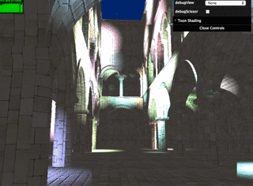
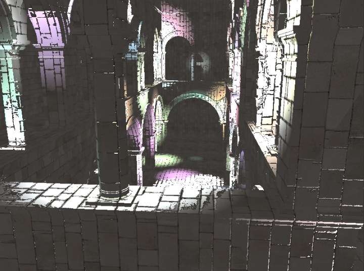
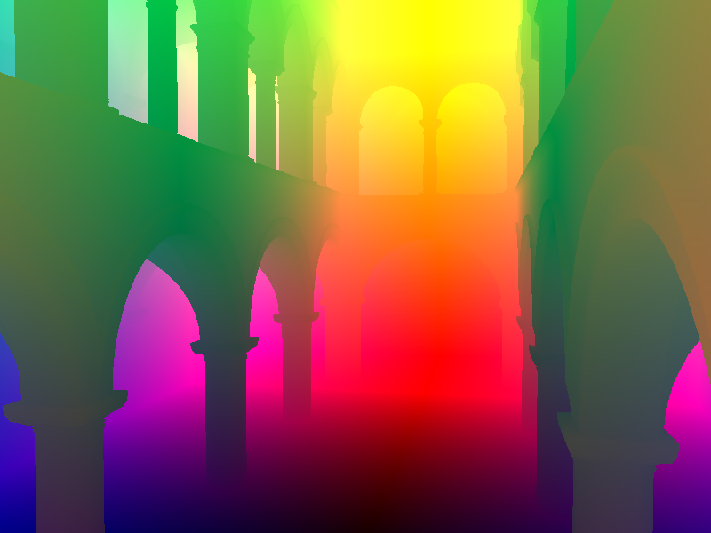
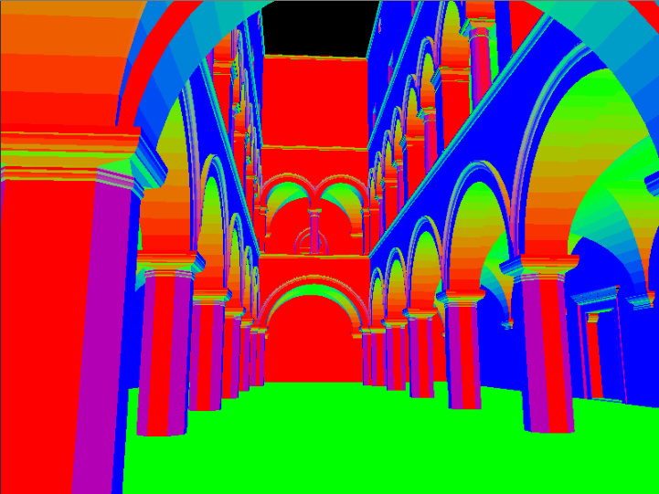
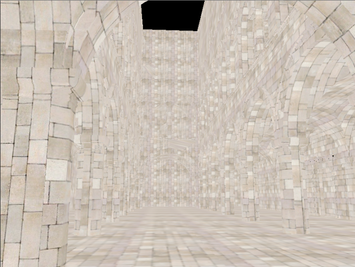
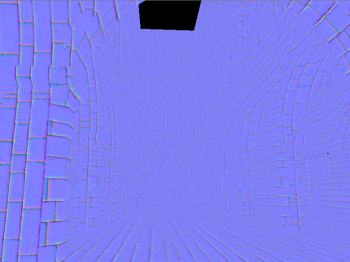
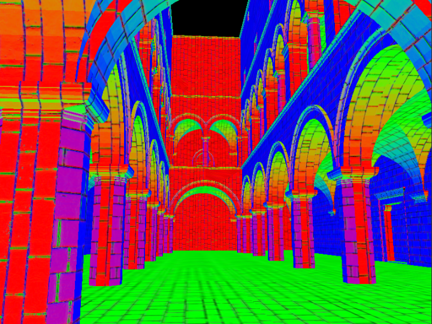
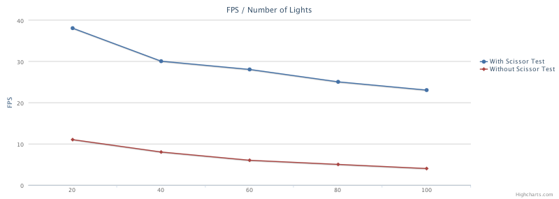
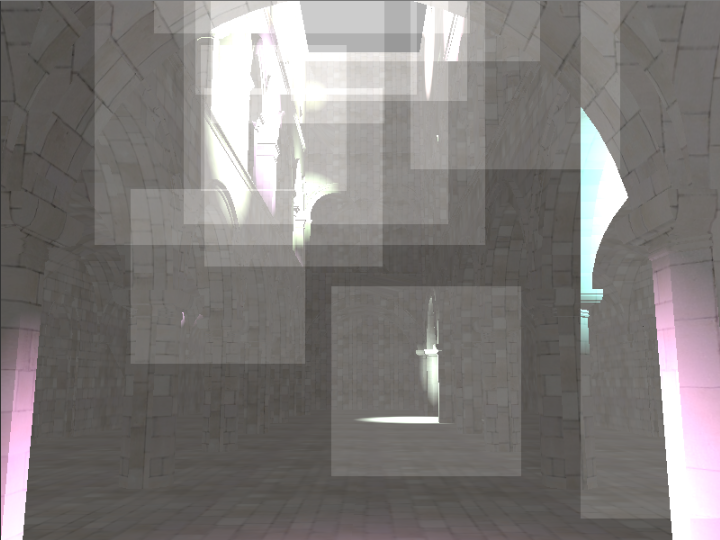

WebGL Deferred Shading
======================

**University of Pennsylvania, CIS 565: GPU Programming and Architecture, Project 6**

* Sally Kong
* Tested on: Google Chrome 46, Macbook Air 2014, 1.4 GHz Intel Core i5, ntel HD Graphics 5000 1536 MB (Personal)

### Live Online

### Demo Video

###Toon Shading
* With Ramp Shading and Outlines

### Debug Images

|Depth | Position | Geometry Normal|
|:-------------:|:-------------:|:-------------:|
| |  | |
|Color Map | Normal Map | Surface Normal|
| |  | |

## Performance Analysis

* Enabling the Scissor Test almost quadrupled the FPS

* It reduced rendering time by about half

 | With Scissor Test | Without Scissor Test | 
 |:-------------:|:-------------:|
 | 0~11 MS| 0~20 MS|

* Scissor Test Screenshot

